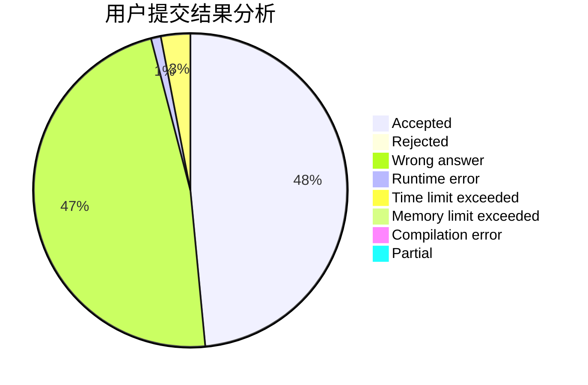
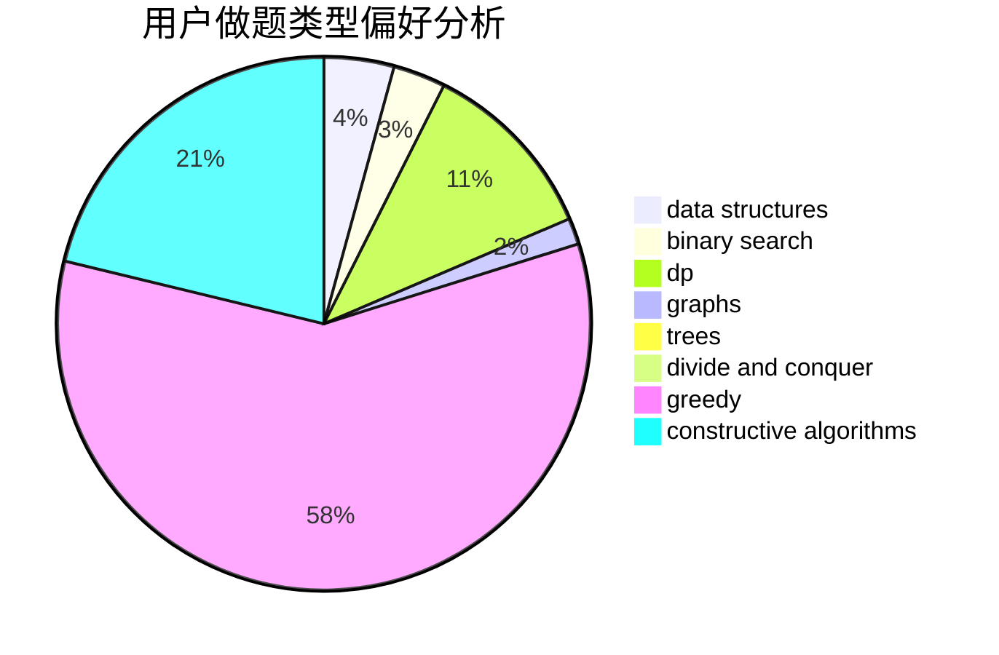
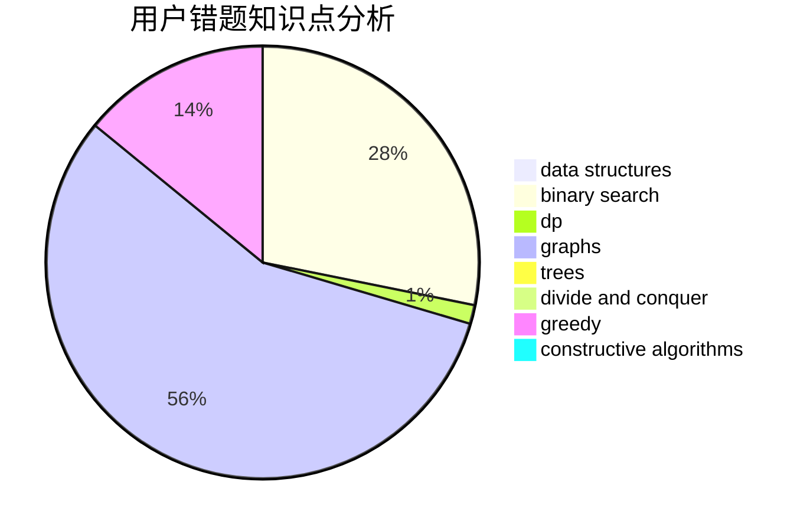

# snewptl

<!-- tabs:start -->

#### **用户提交结果分析**

#### **用户做题类型偏好分析**

#### **用户错题知识点分析**

<!-- tabs:end -->
# 推荐题目
[1092E](https://codeforces.com/contest/1092/problem/E)		constructive algorithms,
                        dfs and similar,
                        greedy,
                        trees		  
[909F](https://codeforces.com/contest/909/problem/F)		constructive algorithms		  
[924A](https://codeforces.com/contest/924/problem/A)		greedy,
                        implementation		  
[1354F](https://codeforces.com/contest/1354/problem/F)		constructive algorithms,
                        dp,
                        flows,
                        graph matchings,
                        greedy,
                        sortings		  
[26A](https://codeforces.com/contest/26/problem/A)		number theory		  
[707D](https://codeforces.com/contest/707/problem/D)		bitmasks,
                        data structures,
                        dfs and similar,
                        implementation		  
[1166D](https://codeforces.com/contest/1166/problem/D)		binary search,
                        brute force,
                        greedy,
                        math		  
[681B](https://codeforces.com/contest/681/problem/B)		brute force		  
[986C](https://codeforces.com/contest/986/problem/C)		bitmasks,
                        dfs and similar,
                        dsu,
                        graphs		  
[1326B](https://codeforces.com/contest/1326/problem/B)		implementation,
                        math		  
