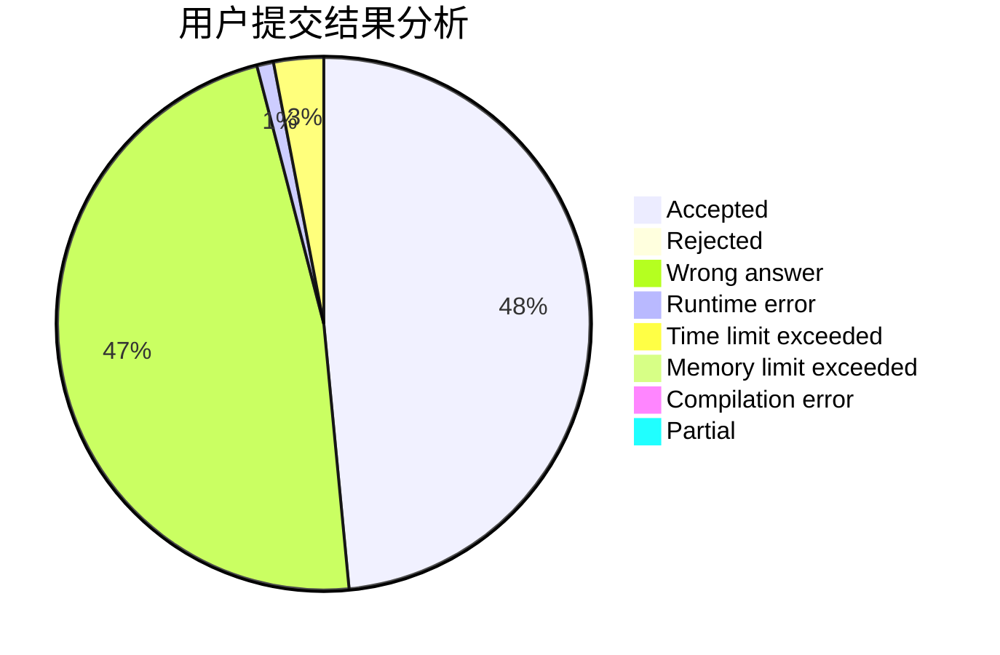
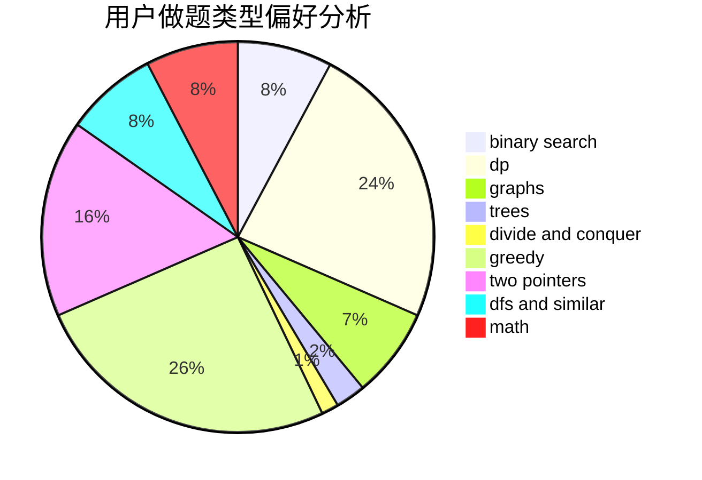

# snewptl

<!-- tabs:start -->

#### **用户提交结果分析**

#### **用户做题类型偏好分析**

<!-- tabs:end -->
# 推荐题目
[1093B](https://codeforces.com/contest/1093/problem/B)
[924D](https://codeforces.com/contest/924/problem/D)
[947D](https://codeforces.com/contest/947/problem/D)
[1361C](https://codeforces.com/contest/1361/problem/C)
[286B](https://codeforces.com/contest/286/problem/B)
[725F](https://codeforces.com/contest/725/problem/F)
[1169C](https://codeforces.com/contest/1169/problem/C)
[705A](https://codeforces.com/contest/705/problem/A)
[acmsguru5](https://codeforces.com/contest/acmsguru/problem/5)
[1332D](https://codeforces.com/contest/1332/problem/D)
