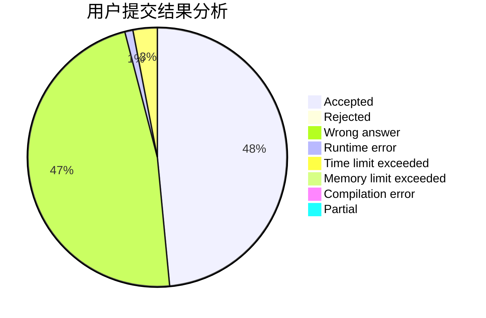
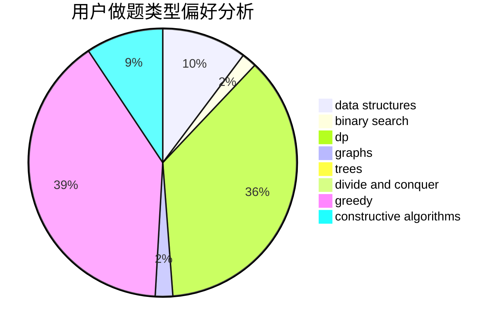
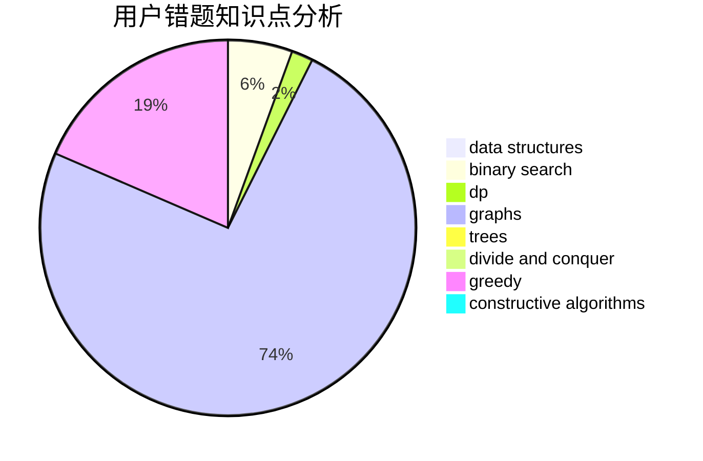

# snewptl

<!-- tabs:start -->

#### **用户提交结果分析**

#### **用户做题类型偏好分析**

#### **用户错题知识点分析**

<!-- tabs:end -->
# 推荐题目
[1093B](https://codeforces.com/contest/1093/problem/B)		constructive algorithms,
                        greedy,
                        sortings,
                        strings		  
[924D](https://codeforces.com/contest/924/problem/D)		nan		  
[947D](https://codeforces.com/contest/947/problem/D)		dsu,graphs,sortings,trees		  
[1361C](https://codeforces.com/contest/1361/problem/C)		binary search,
                        bitmasks,
                        constructive algorithms,
                        dfs and similar,
                        dsu,
                        graphs		  
[286B](https://codeforces.com/contest/286/problem/B)		implementation		  
[725F](https://codeforces.com/contest/725/problem/F)		games,
                        greedy		  
[1169C](https://codeforces.com/contest/1169/problem/C)		dsu,graphs,sortings,trees		  
[705A](https://codeforces.com/contest/705/problem/A)		implementation		  
[acmsguru5](https://codeforces.com/contest/acmsguru/problem/5)		dsu,graphs,sortings,trees		  
[1332D](https://codeforces.com/contest/1332/problem/D)		bitmasks,
                        constructive algorithms,
                        math		  
