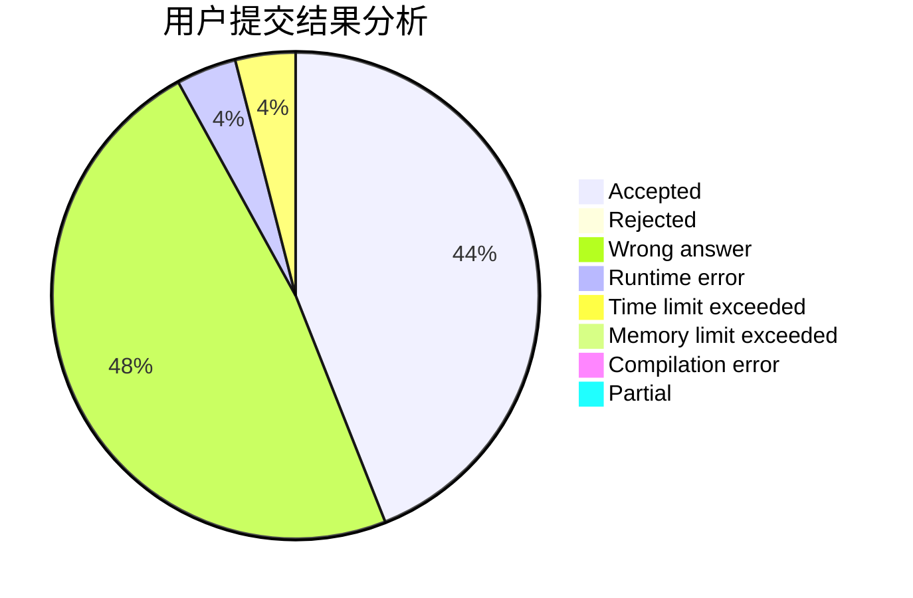
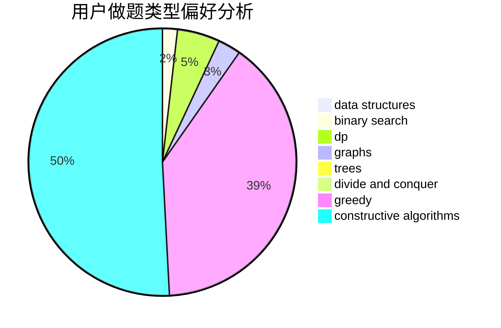

# so_ysc

<!-- tabs:start -->

#### **用户提交结果分析**

#### **用户做题类型偏好分析**

#### **用户错题知识点分析**

<!-- tabs:end -->
# 推荐题目
[1154A](https://codeforces.com/contest/1154/problem/A)		math		  
[1140F](https://codeforces.com/contest/1140/problem/F)		data structures,
                        divide and conquer,
                        dsu		  
[18E](https://codeforces.com/contest/18/problem/E)		dp		  
[803G](https://codeforces.com/contest/803/problem/G)		data structures		  
[571A](https://codeforces.com/contest/571/problem/A)		combinatorics,
                        implementation,
                        math		  
[171E](https://codeforces.com/contest/171/problem/E)		*special problem		  
[837C](https://codeforces.com/contest/837/problem/C)		brute force,
                        implementation		  
[1252G](https://codeforces.com/contest/1252/problem/G)		data structures		  
[56A](https://codeforces.com/contest/56/problem/A)		implementation		  
[772C](https://codeforces.com/contest/772/problem/C)		constructive algorithms,
                        dp,
                        graphs,
                        math,
                        number theory		  
