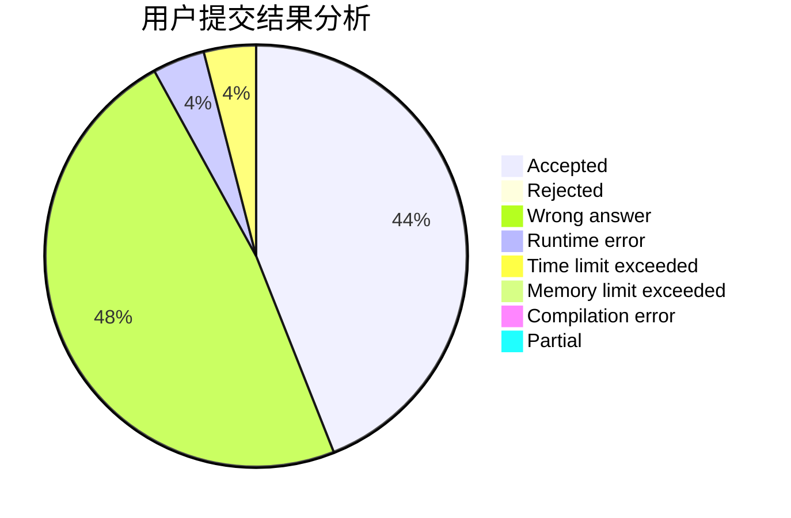
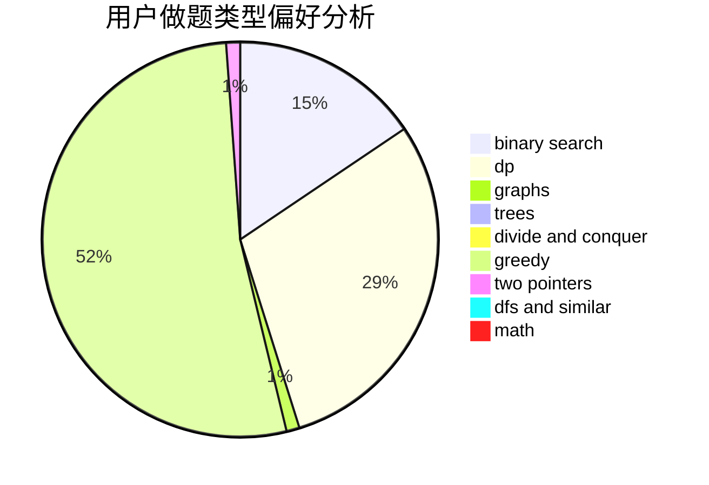

# so_ysc

<!-- tabs:start -->

#### **用户提交结果分析**

#### **用户做题类型偏好分析**

<!-- tabs:end -->
# 推荐题目
[1156A](https://codeforces.com/contest/1156/problem/A)
[1142D](https://codeforces.com/contest/1142/problem/D)
[215C](https://codeforces.com/contest/215/problem/C)
[81C](https://codeforces.com/contest/81/problem/C)
[591C](https://codeforces.com/contest/591/problem/C)
[199B](https://codeforces.com/contest/199/problem/B)
[854C](https://codeforces.com/contest/854/problem/C)
[125A](https://codeforces.com/contest/125/problem/A)
[58C](https://codeforces.com/contest/58/problem/C)
[792A](https://codeforces.com/contest/792/problem/A)
