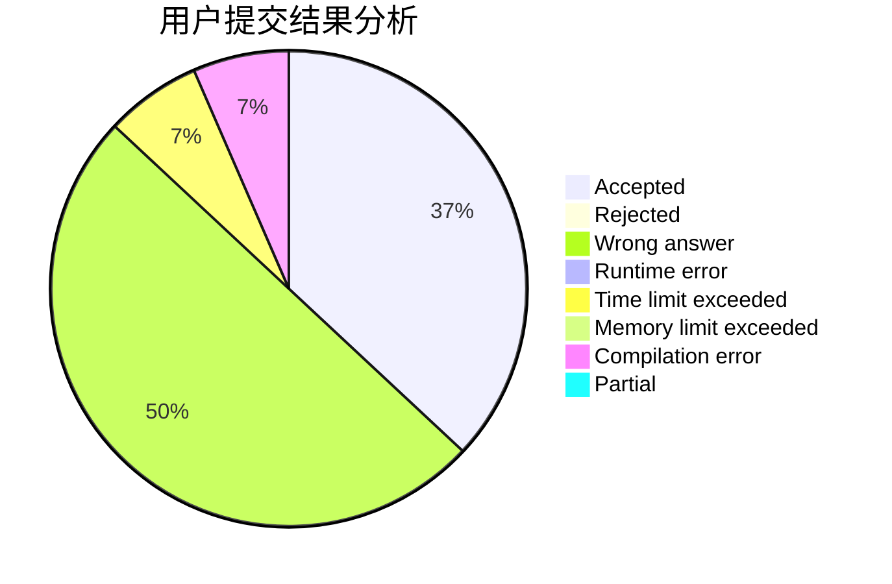
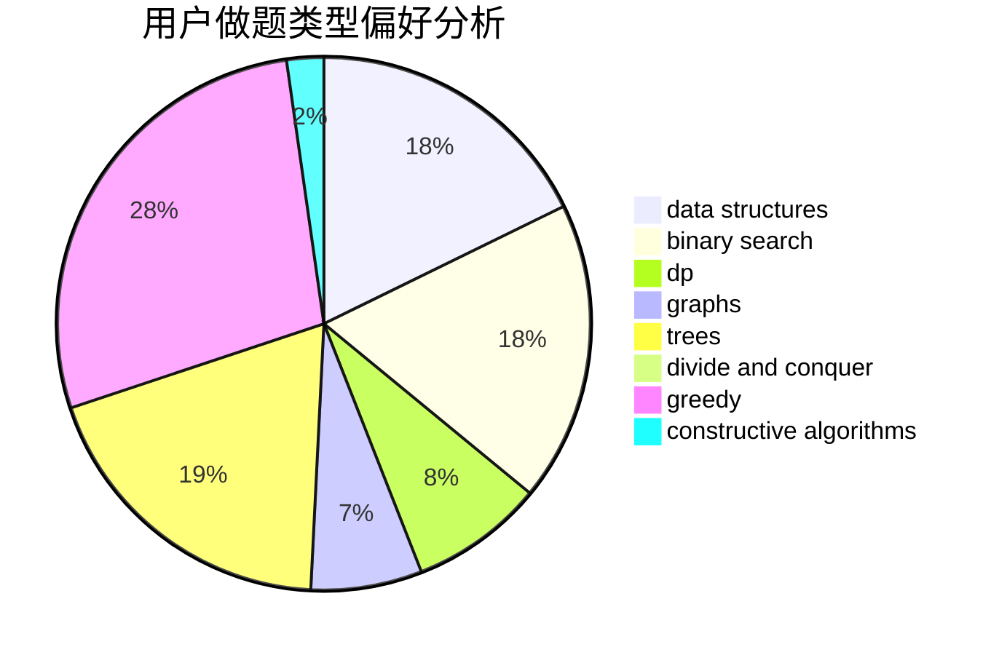

# soarid

<!-- tabs:start -->

#### **用户提交结果分析**

#### **用户做题类型偏好分析**

#### **用户错题知识点分析**

<!-- tabs:end -->
# 推荐题目
[1304D](https://codeforces.com/contest/1304/problem/D)		constructive algorithms,
                        graphs,
                        greedy,
                        two pointers		  
[149E](https://codeforces.com/contest/149/problem/E)		string suffix structures,
                        strings		  
[840C](https://codeforces.com/contest/840/problem/C)		combinatorics,
                        dp		  
[1184B2](https://codeforces.com/contest/1184B/problem/2)		flows,
                        graph matchings,
                        graphs,
                        shortest paths,
                        sortings		  
[231B](https://codeforces.com/contest/231/problem/B)		constructive algorithms,
                        greedy		  
[1391E](https://codeforces.com/contest/1391/problem/E)		constructive algorithms,
                        dfs and similar,
                        graphs,
                        greedy,
                        trees		  
[1276B](https://codeforces.com/contest/1276/problem/B)		combinatorics,
                        dfs and similar,
                        dsu,
                        graphs		  
[1062A](https://codeforces.com/contest/1062/problem/A)		greedy,
                        implementation		  
[600A](https://codeforces.com/contest/600/problem/A)		implementation,
                        strings		  
[1011F](https://codeforces.com/contest/1011/problem/F)		dsu,graphs,sortings,trees		  
