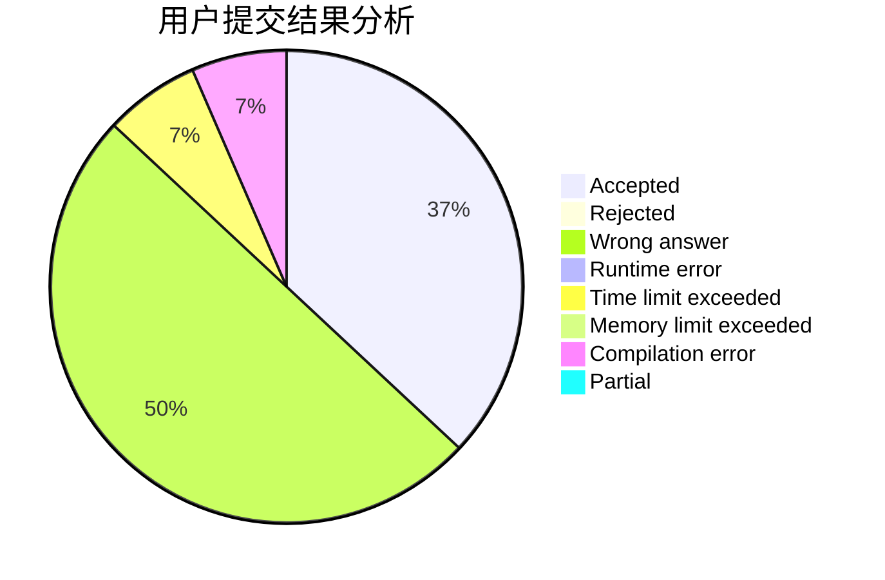
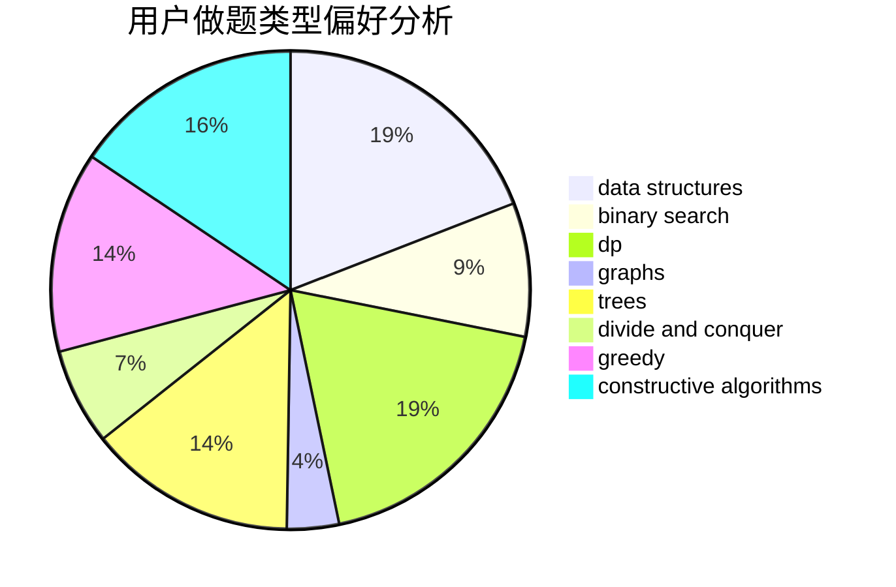

# soarid

<!-- tabs:start -->

#### **用户提交结果分析**

#### **用户做题类型偏好分析**

#### **用户错题知识点分析**

<!-- tabs:end -->
# 推荐题目
[13132](https://codeforces.com/contest/1313/problem/2)		dsu,graphs,sortings,trees		  
[1510A](https://codeforces.com/contest/1510/problem/A)		nan		  
[85A](https://codeforces.com/contest/85/problem/A)		constructive algorithms,
                        implementation		  
[1187E](https://codeforces.com/contest/1187/problem/E)		dfs and similar,
                        dp,
                        trees		  
[252A](https://codeforces.com/contest/252/problem/A)		brute force,
                        implementation		  
[13B](https://codeforces.com/contest/13/problem/B)		geometry,
                        implementation		  
[1282C](https://codeforces.com/contest/1282/problem/C)		greedy,
                        sortings,
                        two pointers		  
[1062D](https://codeforces.com/contest/1062/problem/D)		dfs and similar,
                        graphs,
                        implementation,
                        math		  
[618G](https://codeforces.com/contest/618/problem/G)		dp,
                        math,
                        matrices,
                        probabilities		  
[1012C](https://codeforces.com/contest/1012/problem/C)		dp		  
