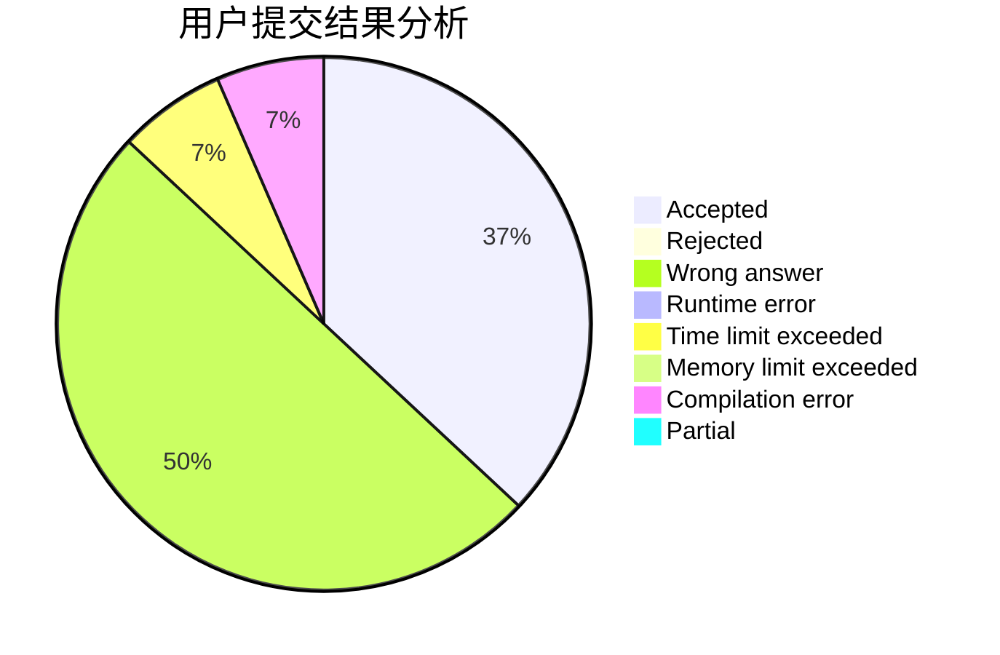
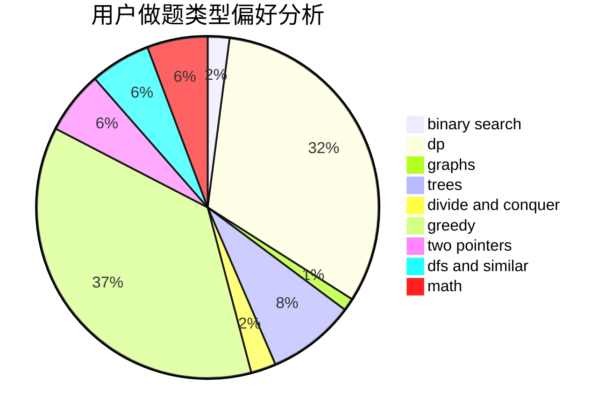

# soarid

<!-- tabs:start -->

#### **用户提交结果分析**

#### **用户做题类型偏好分析**

<!-- tabs:end -->
# 推荐题目
[13132](https://codeforces.com/contest/1313/problem/2)
[1510A](https://codeforces.com/contest/1510/problem/A)
[85A](https://codeforces.com/contest/85/problem/A)
[1187E](https://codeforces.com/contest/1187/problem/E)
[252A](https://codeforces.com/contest/252/problem/A)
[13B](https://codeforces.com/contest/13/problem/B)
[1282C](https://codeforces.com/contest/1282/problem/C)
[1062D](https://codeforces.com/contest/1062/problem/D)
[618G](https://codeforces.com/contest/618/problem/G)
[1012C](https://codeforces.com/contest/1012/problem/C)
