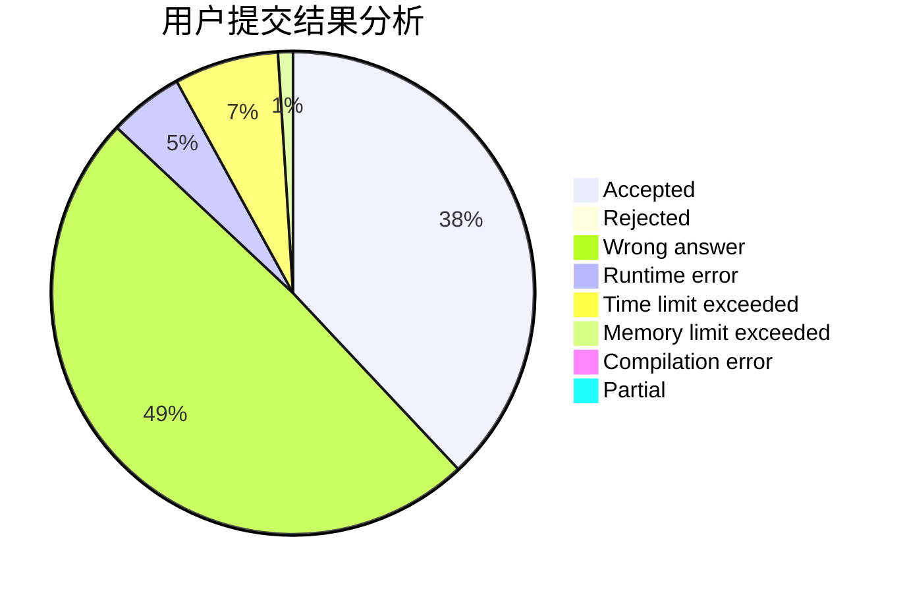
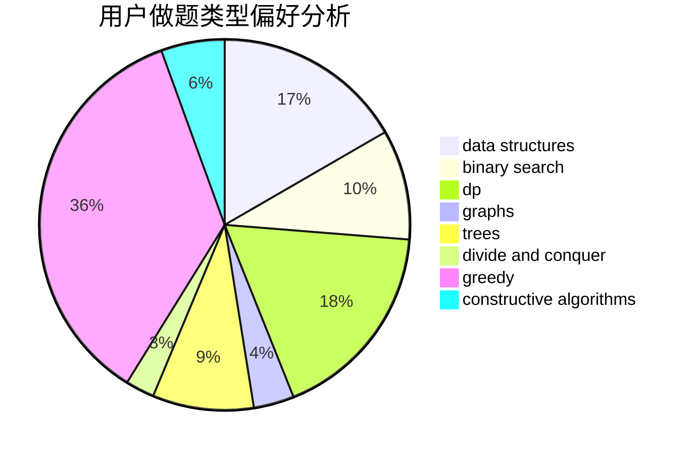
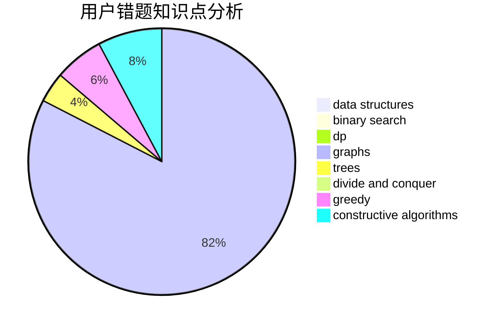

# soler

<!-- tabs:start -->

#### **用户提交结果分析**

#### **用户做题类型偏好分析**

#### **用户错题知识点分析**

<!-- tabs:end -->
# 推荐题目
[571D](https://codeforces.com/contest/571/problem/D)		binary search,
                        data structures,
                        dsu,
                        trees		  
[1020E](https://codeforces.com/contest/1020/problem/E)		dsu,graphs,sortings,trees		  
[1140F](https://codeforces.com/contest/1140/problem/F)		data structures,
                        divide and conquer,
                        dsu		  
[1147F](https://codeforces.com/contest/1147/problem/F)		games,
                        interactive		  
[859F](https://codeforces.com/contest/859/problem/F)		greedy		  
[1032E](https://codeforces.com/contest/1032/problem/E)		dp,
                        math		  
[1023G](https://codeforces.com/contest/1023/problem/G)		data structures,
                        flows,
                        trees		  
[317C](https://codeforces.com/contest/317/problem/C)		constructive algorithms,
                        dfs and similar,
                        graphs,
                        trees		  
[1115U3](https://codeforces.com/contest/1115U/problem/3)		*special problem		  
[976E](https://codeforces.com/contest/976/problem/E)		greedy,
                        sortings		  
