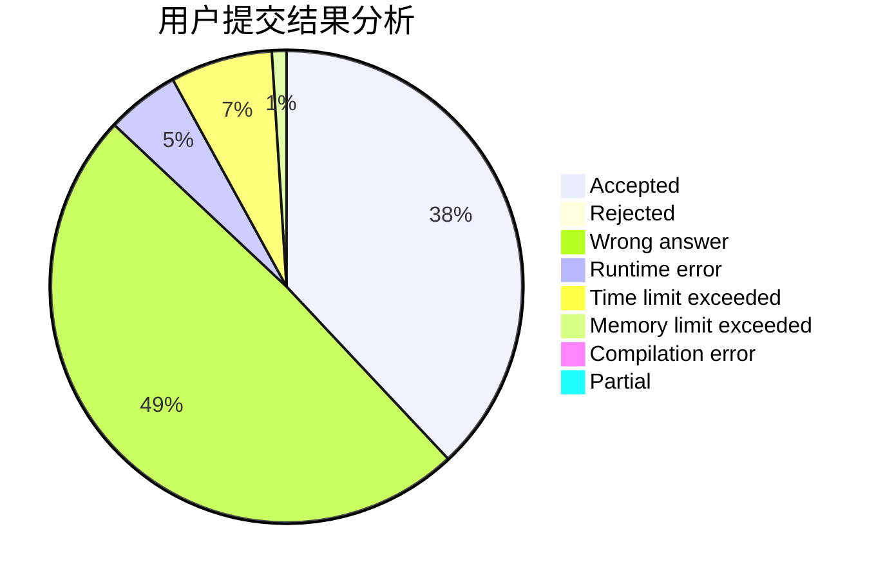
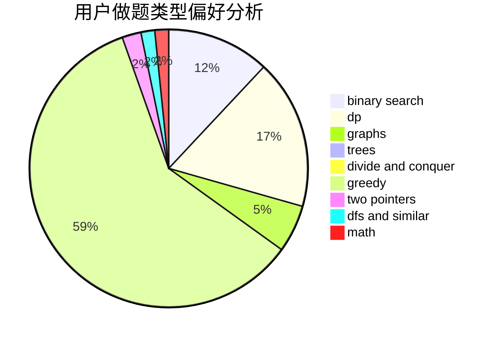

# soler

<!-- tabs:start -->

#### **用户提交结果分析**

#### **用户做题类型偏好分析**

<!-- tabs:end -->
# 推荐题目
[592A](https://codeforces.com/contest/592/problem/A)
[1023C](https://codeforces.com/contest/1023/problem/C)
[1142D](https://codeforces.com/contest/1142/problem/D)
[1149E](https://codeforces.com/contest/1149/problem/E)
[877C](https://codeforces.com/contest/877/problem/C)
[1033B](https://codeforces.com/contest/1033/problem/B)
[1025C](https://codeforces.com/contest/1025/problem/C)
[346E](https://codeforces.com/contest/346/problem/E)
[1117C](https://codeforces.com/contest/1117/problem/C)
[990D](https://codeforces.com/contest/990/problem/D)
