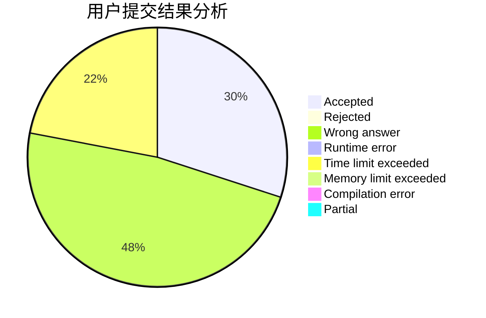
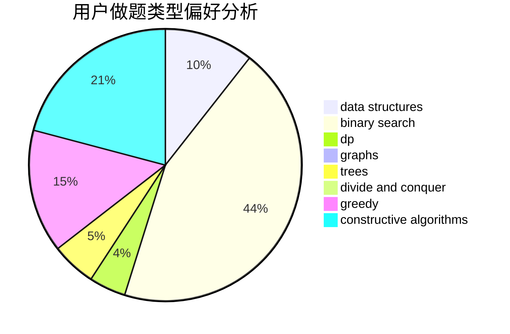
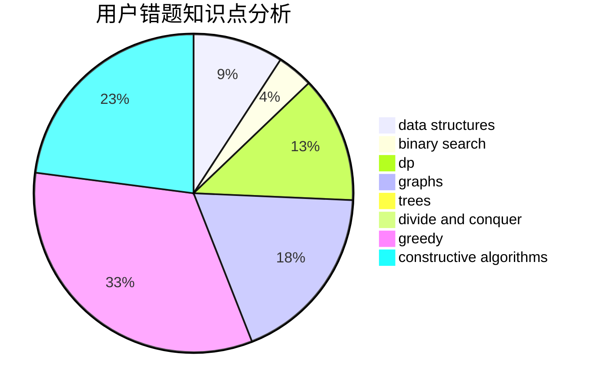

# someboody

<!-- tabs:start -->

#### **用户提交结果分析**

#### **用户做题类型偏好分析**

#### **用户错题知识点分析**

<!-- tabs:end -->
# 推荐题目
[536D](https://codeforces.com/contest/536/problem/D)		dp,
                        games		  
[956B](https://codeforces.com/contest/956/problem/B)		dsu,graphs,sortings,trees		  
[912E](https://codeforces.com/contest/912/problem/E)		binary search,
                        dfs and similar,
                        math,
                        meet-in-the-middle,
                        number theory,
                        two pointers		  
[1251B](https://codeforces.com/contest/1251/problem/B)		greedy,
                        strings		  
[899E](https://codeforces.com/contest/899/problem/E)		data structures,
                        dsu,
                        flows,
                        implementation,
                        two pointers		  
[1111B](https://codeforces.com/contest/1111/problem/B)		brute force,
                        implementation,
                        math		  
[1143C](https://codeforces.com/contest/1143/problem/C)		dfs and similar,
                        trees		  
[1064C](https://codeforces.com/contest/1064/problem/C)		dsu,graphs,sortings,trees		  
[348A](https://codeforces.com/contest/348/problem/A)		binary search,
                        math,
                        sortings		  
[1272D](https://codeforces.com/contest/1272/problem/D)		brute force,
                        dp		  
