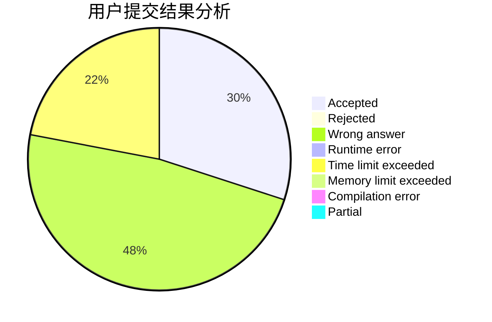
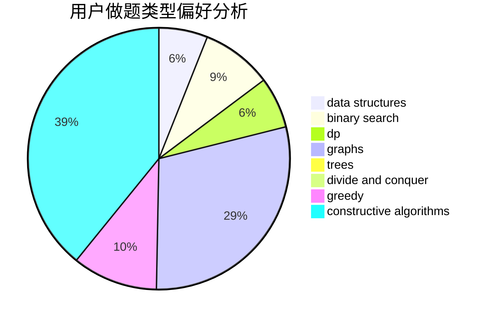
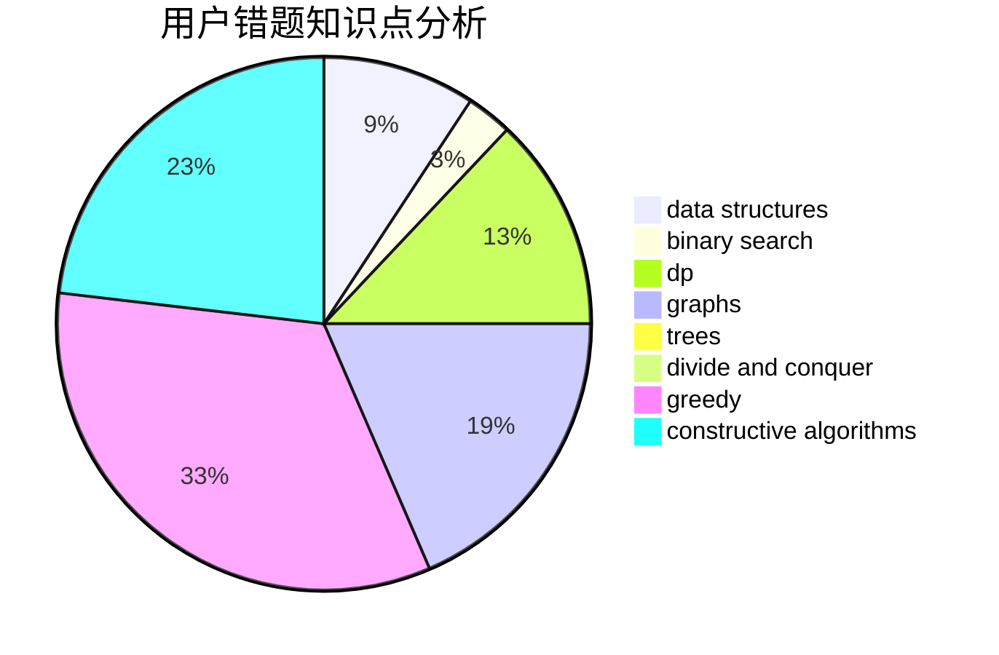

# someboody

<!-- tabs:start -->

#### **用户提交结果分析**

#### **用户做题类型偏好分析**

#### **用户错题知识点分析**

<!-- tabs:end -->
# 推荐题目
[559A](https://codeforces.com/contest/559/problem/A)		brute force,
                        geometry,
                        math		  
[977F](https://codeforces.com/contest/977/problem/F)		dp		  
[931C](https://codeforces.com/contest/931/problem/C)		implementation,
                        math		  
[1256C](https://codeforces.com/contest/1256/problem/C)		greedy		  
[915E](https://codeforces.com/contest/915/problem/E)		data structures,
                        implementation,
                        sortings		  
[1113A](https://codeforces.com/contest/1113/problem/A)		dp,
                        greedy,
                        math		  
[1145C](https://codeforces.com/contest/1145/problem/C)		bitmasks,
                        brute force		  
[1064F](https://codeforces.com/contest/1064/problem/F)		dsu,graphs,sortings,trees		  
[372D](https://codeforces.com/contest/372/problem/D)		binary search,
                        data structures,
                        dfs and similar,
                        trees,
                        two pointers		  
[1281F](https://codeforces.com/contest/1281/problem/F)		dsu,graphs,sortings,trees		  
