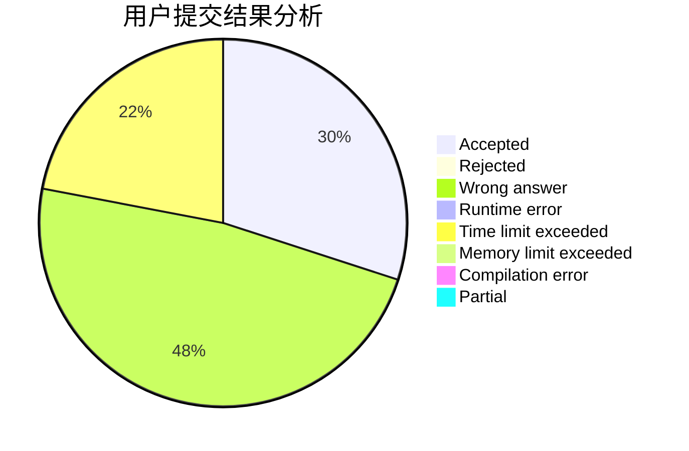
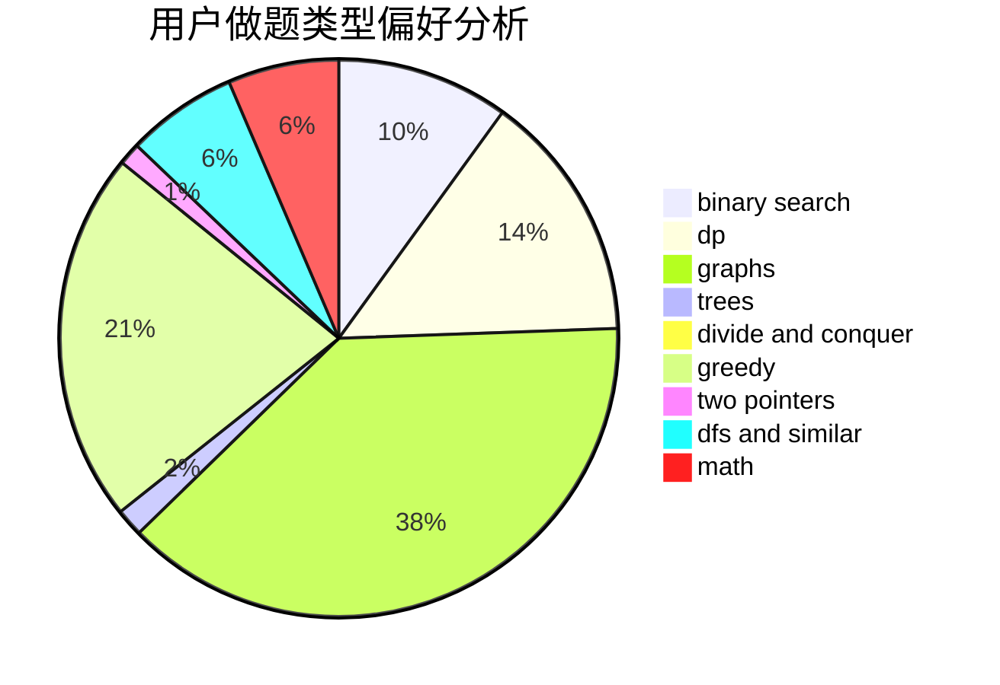

# someboody

<!-- tabs:start -->

#### **用户提交结果分析**

#### **用户做题类型偏好分析**

<!-- tabs:end -->
# 推荐题目
[559A](https://codeforces.com/contest/559/problem/A)
[977F](https://codeforces.com/contest/977/problem/F)
[931C](https://codeforces.com/contest/931/problem/C)
[1256C](https://codeforces.com/contest/1256/problem/C)
[915E](https://codeforces.com/contest/915/problem/E)
[1113A](https://codeforces.com/contest/1113/problem/A)
[1145C](https://codeforces.com/contest/1145/problem/C)
[1064F](https://codeforces.com/contest/1064/problem/F)
[372D](https://codeforces.com/contest/372/problem/D)
[1281F](https://codeforces.com/contest/1281/problem/F)
