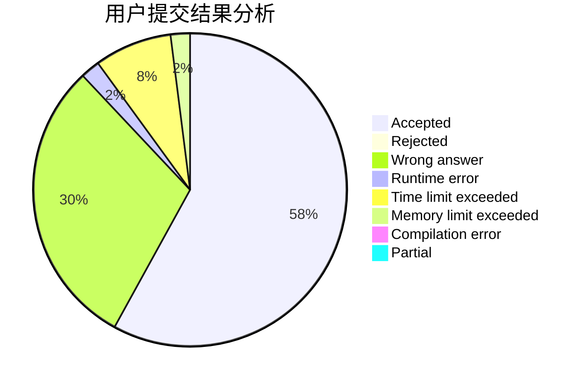
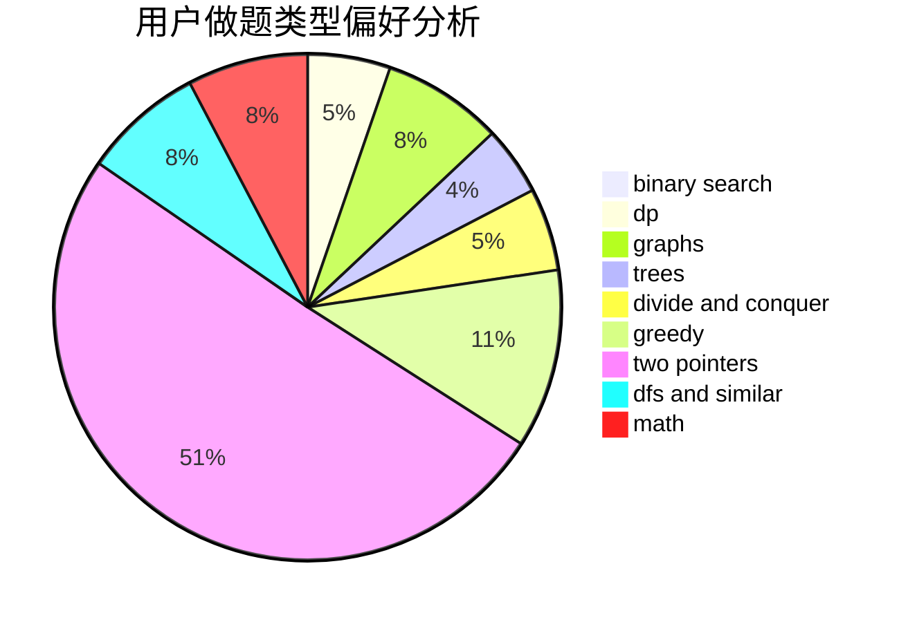

# sonder.

<!-- tabs:start -->

#### **用户提交结果分析**

#### **用户做题类型偏好分析**

<!-- tabs:end -->
# 推荐题目
[19A](https://codeforces.com/contest/19/problem/A)
[356A](https://codeforces.com/contest/356/problem/A)
[1310E](https://codeforces.com/contest/1310/problem/E)
[1038A](https://codeforces.com/contest/1038/problem/A)
[879D](https://codeforces.com/contest/879/problem/D)
[1117G](https://codeforces.com/contest/1117/problem/G)
[379C](https://codeforces.com/contest/379/problem/C)
[853A](https://codeforces.com/contest/853/problem/A)
[1093F](https://codeforces.com/contest/1093/problem/F)
[729F](https://codeforces.com/contest/729/problem/F)
