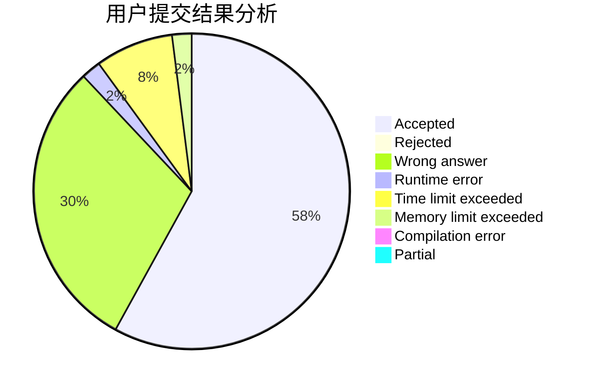
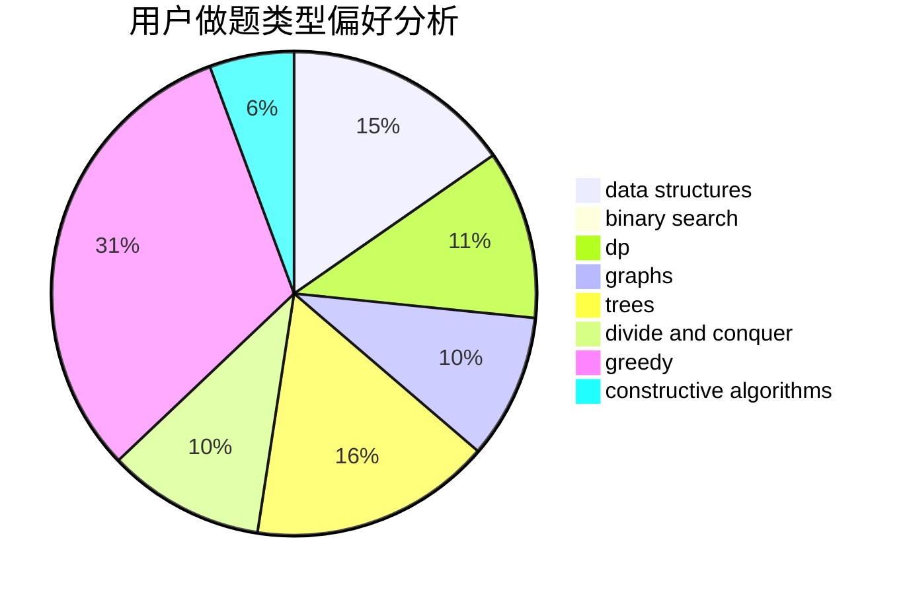
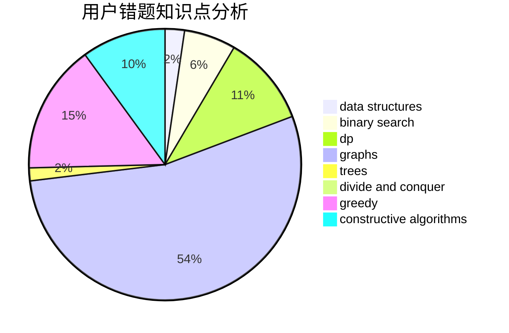

# sonder.

<!-- tabs:start -->

#### **用户提交结果分析**

#### **用户做题类型偏好分析**

#### **用户错题知识点分析**

<!-- tabs:end -->
# 推荐题目
[19A](https://codeforces.com/contest/19/problem/A)		implementation		  
[356A](https://codeforces.com/contest/356/problem/A)		data structures,
                        dsu		  
[1310E](https://codeforces.com/contest/1310/problem/E)		dp		  
[1038A](https://codeforces.com/contest/1038/problem/A)		implementation,
                        strings		  
[879D](https://codeforces.com/contest/879/problem/D)		dsu,graphs,sortings,trees		  
[1117G](https://codeforces.com/contest/1117/problem/G)		data structures		  
[379C](https://codeforces.com/contest/379/problem/C)		greedy,
                        sortings		  
[853A](https://codeforces.com/contest/853/problem/A)		greedy		  
[1093F](https://codeforces.com/contest/1093/problem/F)		dp		  
[729F](https://codeforces.com/contest/729/problem/F)		dp		  
