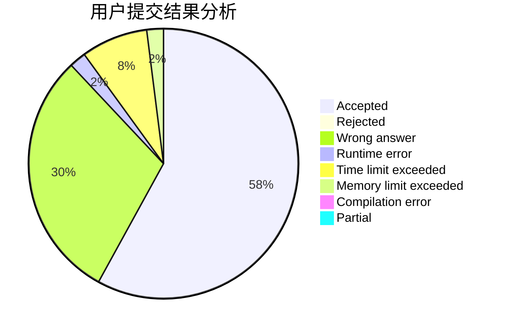
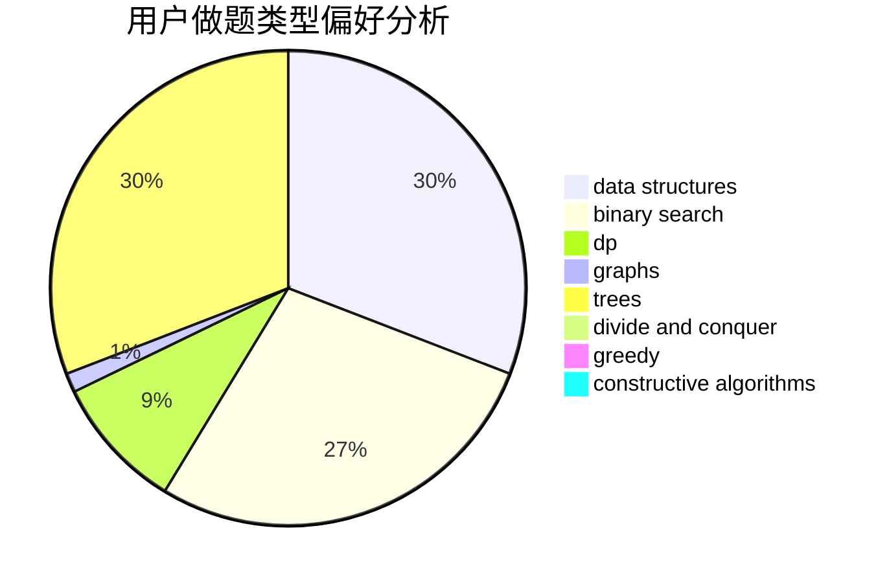
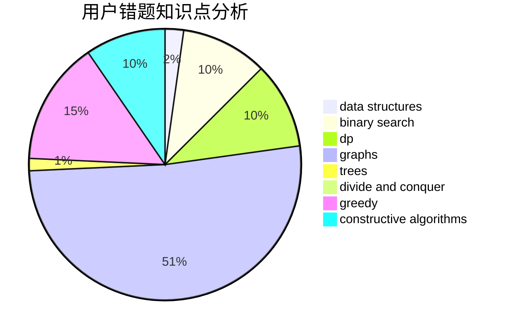

# sonder.

<!-- tabs:start -->

#### **用户提交结果分析**

#### **用户做题类型偏好分析**

#### **用户错题知识点分析**

<!-- tabs:end -->
# 推荐题目
[171H](https://codeforces.com/contest/171/problem/H)		*special problem,
                        implementation		  
[325E](https://codeforces.com/contest/325/problem/E)		combinatorics,
                        dfs and similar,
                        dsu,
                        graphs,
                        greedy		  
[1301B](https://codeforces.com/contest/1301/problem/B)		binary search,
                        greedy,
                        ternary search		  
[1037F](https://codeforces.com/contest/1037/problem/F)		combinatorics,
                        data structures,
                        math		  
[862A](https://codeforces.com/contest/862/problem/A)		greedy,
                        implementation		  
[1116C1](https://codeforces.com/contest/1116C/problem/1)		nan		  
[352A](https://codeforces.com/contest/352/problem/A)		brute force,
                        implementation,
                        math		  
[835C](https://codeforces.com/contest/835/problem/C)		dp,
                        implementation		  
[1093C](https://codeforces.com/contest/1093/problem/C)		greedy		  
[709E](https://codeforces.com/contest/709/problem/E)		dsu,graphs,sortings,trees		  
