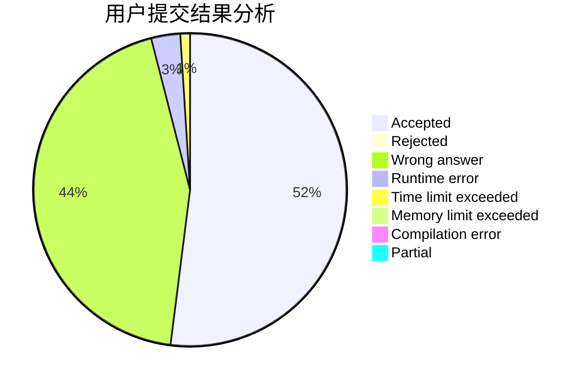
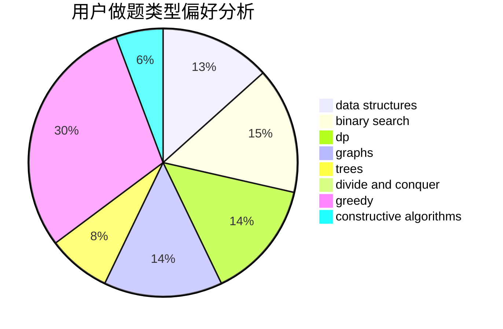

# song

<!-- tabs:start -->

#### **用户提交结果分析**

#### **用户做题类型偏好分析**

#### **用户错题知识点分析**

<!-- tabs:end -->
# 推荐题目
[1068C](https://codeforces.com/contest/1068/problem/C)		constructive algorithms,
                        graphs		  
[1298D](https://codeforces.com/contest/1298/problem/D)		dsu,graphs,sortings,trees		  
[1147A](https://codeforces.com/contest/1147/problem/A)		graphs		  
[183A](https://codeforces.com/contest/183/problem/A)		constructive algorithms,
                        math		  
[665F](https://codeforces.com/contest/665/problem/F)		data structures,
                        dp,
                        math,
                        number theory,
                        sortings,
                        two pointers		  
[44C](https://codeforces.com/contest/44/problem/C)		implementation		  
[236D](https://codeforces.com/contest/236/problem/D)		dsu,graphs,sortings,trees		  
[1322A](https://codeforces.com/contest/1322/problem/A)		greedy		  
[994A](https://codeforces.com/contest/994/problem/A)		implementation		  
[292E](https://codeforces.com/contest/292/problem/E)		data structures		  
