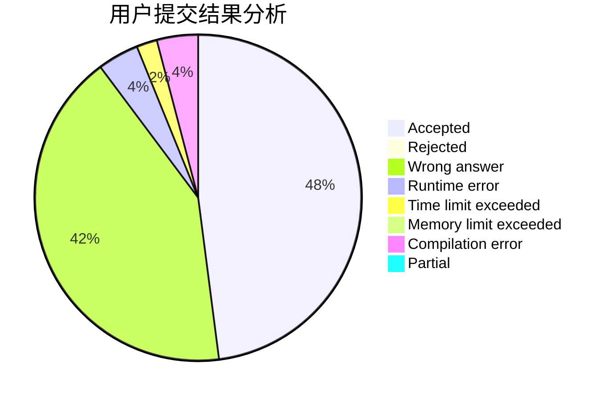
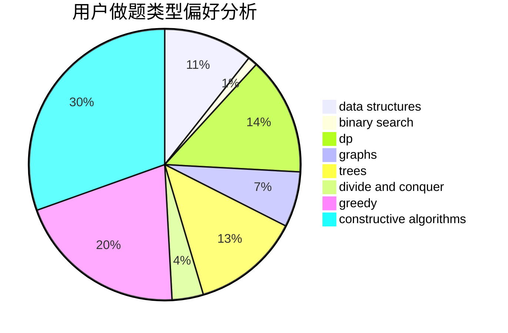
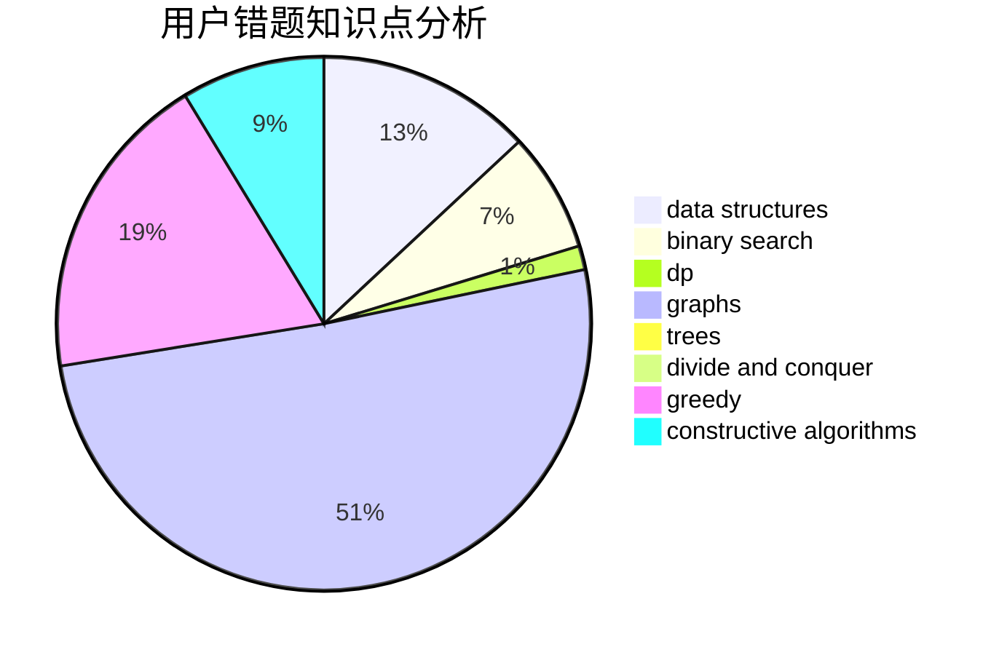

# songer

<!-- tabs:start -->

#### **用户提交结果分析**

#### **用户做题类型偏好分析**

#### **用户错题知识点分析**

<!-- tabs:end -->
# 推荐题目
[13042](https://codeforces.com/contest/1304/problem/2)		dsu,graphs,sortings,trees		  
[11162](https://codeforces.com/contest/1116/problem/2)		dsu,graphs,sortings,trees		  
[883A](https://codeforces.com/contest/883/problem/A)		implementation		  
[1159C](https://codeforces.com/contest/1159/problem/C)		dsu,graphs,sortings,trees		  
[75D](https://codeforces.com/contest/75/problem/D)		data structures,
                        dp,
                        greedy,
                        implementation,
                        math,
                        trees		  
[1264C](https://codeforces.com/contest/1264/problem/C)		data structures,
                        probabilities		  
[122A](https://codeforces.com/contest/122/problem/A)		brute force,
                        number theory		  
[730B](https://codeforces.com/contest/730/problem/B)		constructive algorithms,
                        interactive		  
[802K](https://codeforces.com/contest/802/problem/K)		dp,
                        trees		  
[1089M](https://codeforces.com/contest/1089/problem/M)		constructive algorithms,
                        graphs		  
