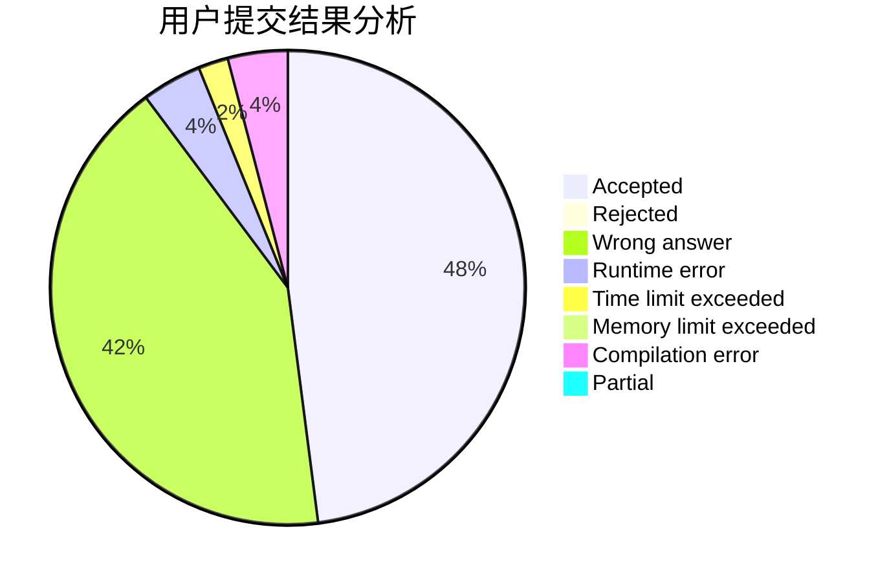
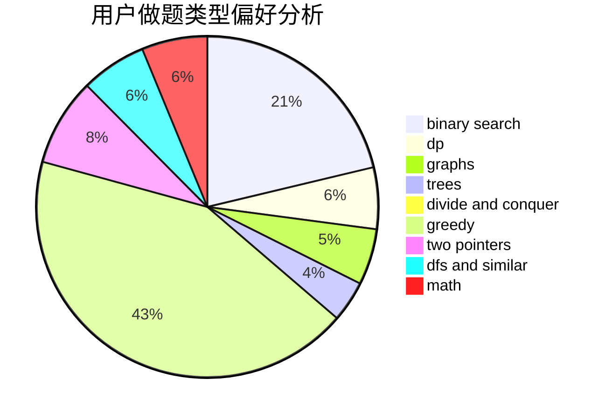

# songer

<!-- tabs:start -->

#### **用户提交结果分析**

#### **用户做题类型偏好分析**

<!-- tabs:end -->
# 推荐题目
[13042](https://codeforces.com/contest/1304/problem/2)
[11162](https://codeforces.com/contest/1116/problem/2)
[883A](https://codeforces.com/contest/883/problem/A)
[1159C](https://codeforces.com/contest/1159/problem/C)
[75D](https://codeforces.com/contest/75/problem/D)
[1264C](https://codeforces.com/contest/1264/problem/C)
[122A](https://codeforces.com/contest/122/problem/A)
[730B](https://codeforces.com/contest/730/problem/B)
[802K](https://codeforces.com/contest/802/problem/K)
[1089M](https://codeforces.com/contest/1089/problem/M)
