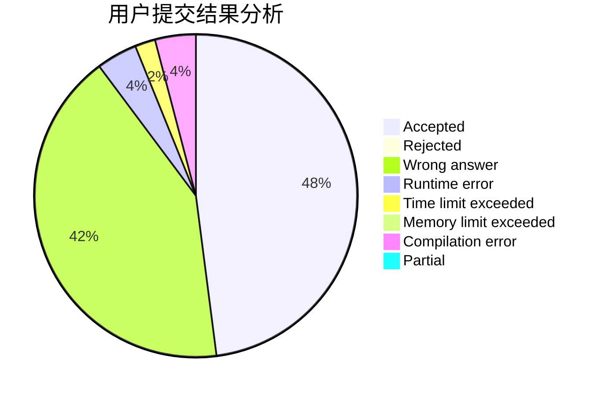
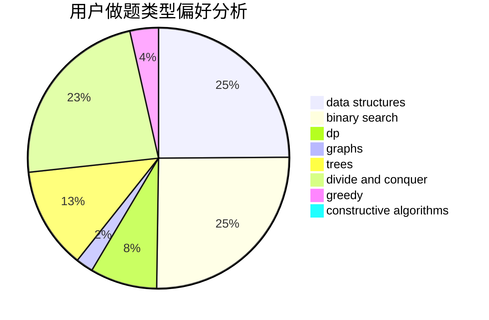
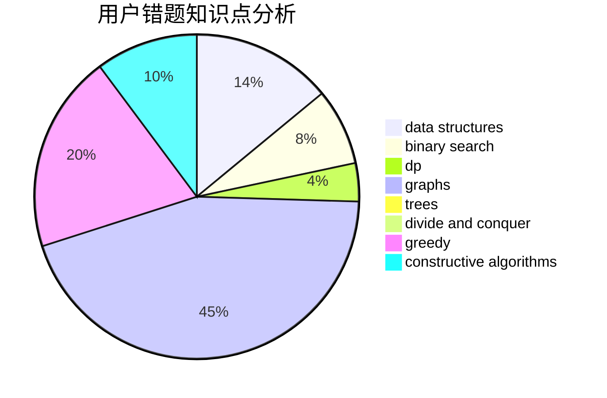

# songer

<!-- tabs:start -->

#### **用户提交结果分析**

#### **用户做题类型偏好分析**

#### **用户错题知识点分析**

<!-- tabs:end -->
# 推荐题目
[1296F](https://codeforces.com/contest/1296/problem/F)		constructive algorithms,
                        dfs and similar,
                        greedy,
                        sortings,
                        trees		  
[1115G2](https://codeforces.com/contest/1115G/problem/2)		*special problem		  
[862D](https://codeforces.com/contest/862/problem/D)		binary search,
                        divide and conquer,
                        interactive		  
[1157C1](https://codeforces.com/contest/1157C/problem/1)		greedy		  
[739D](https://codeforces.com/contest/739/problem/D)		graph matchings		  
[1257C](https://codeforces.com/contest/1257/problem/C)		greedy,
                        implementation,
                        sortings,
                        strings,
                        two pointers		  
[1221E](https://codeforces.com/contest/1221/problem/E)		games		  
[70D](https://codeforces.com/contest/70/problem/D)		data structures,
                        geometry		  
[786A](https://codeforces.com/contest/786/problem/A)		dfs and similar,
                        dp,
                        games		  
[1089I](https://codeforces.com/contest/1089/problem/I)		nan		  
