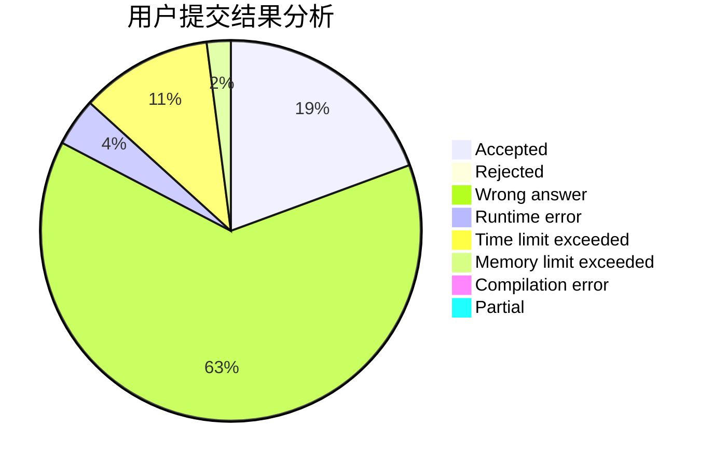
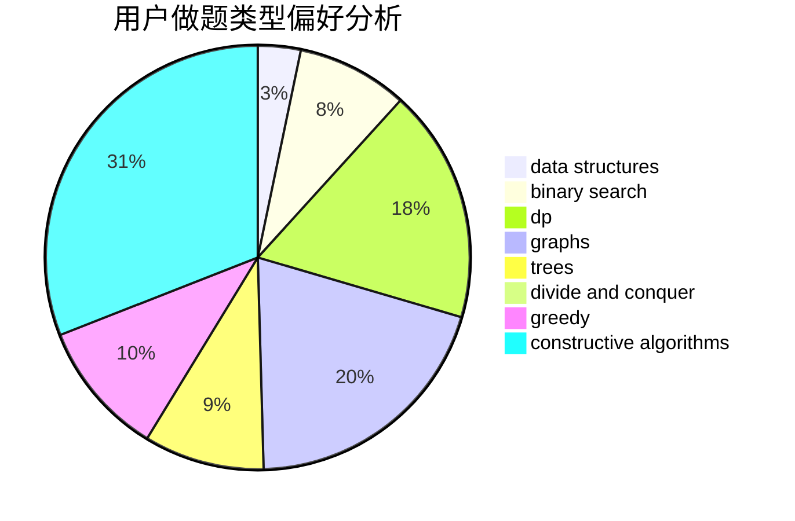
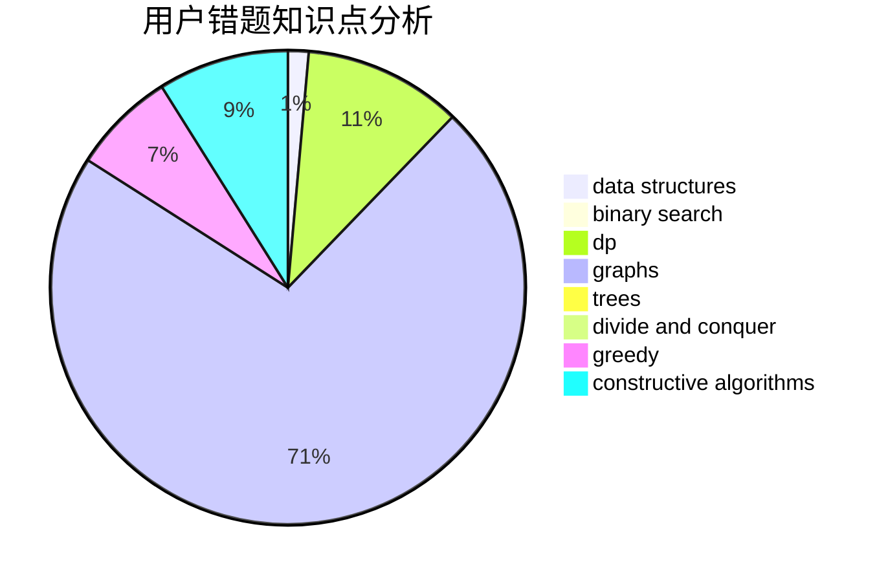

# splay_tree_tag
<!-- tabs:start -->
#### **用户提交结果分析**

#### **用户做题类型偏好分析**

#### **用户错题知识点分析**

<!-- tabs:end -->
# 推荐题目
[Permutation](http://codeforces.com/problemset/problem/359/B)		constructive algorithms,
                        dp,
                        math		  
[Neko Rules the Catniverse (Large Version)](http://codeforces.com/problemset/problem/1152/F2)		bitmasks,
                        dp,
                        matrices		  
[Do you want a date?](https://codeforces.com/contest/810/problem/C)		implementation,
                        math,
                        sortings		  
[R2D2 and Droid Army](http://codeforces.com/problemset/problem/514/D)		binary search,
                        data structures,
                        two pointers		  
[Jeff and Brackets](https://codeforces.com/contest/352/problem/E)		dp,
                        matrices		  
[Array Destruction](http://codeforces.com/problemset/problem/1474/C)		brute force,
                        constructive algorithms,
                        data structures,
                        greedy,
                        implementation,
                        sortings		  
[Little Robber Girl's Zoo](http://codeforces.com/problemset/problem/686/B)		constructive algorithms,
                        implementation,
                        sortings		  
[Subsequences Return](http://codeforces.com/problemset/problem/497/E)		dp,
                        matrices		  
[Cat Party (Easy Edition)](http://codeforces.com/problemset/problem/1163/B1)		data structures,
                        implementation		  
[Balance](http://codeforces.com/problemset/problem/317/C)		constructive algorithms,
                        dfs and similar,
                        graphs,
                        trees		  
<!-- tabs:start -->
#### **data structures**
[Permutation](http://codeforces.com/problemset/problem/514/D)		binary search,
                        data structures,
                        two pointers		  
[Neko Rules the Catniverse (Large Version)](http://codeforces.com/problemset/problem/1474/C)		brute force,
                        constructive algorithms,
                        data structures,
                        greedy,
                        implementation,
                        sortings		  
[Do you want a date?](http://codeforces.com/problemset/problem/1163/B1)		data structures,
                        implementation		  
[R2D2 and Droid Army](http://codeforces.com/problemset/problem/396/C)		data structures,
                        graphs,
                        trees		  
[Jeff and Brackets](http://codeforces.com/problemset/problem/295/A)		data structures,
                        implementation		  
[Array Destruction](https://codeforces.com/contest/1509/problem/F)		data structures,
                        dfs and similar,
                        dsu,
                        graphs,
                        greedy,
                        math		  
[Little Robber Girl's Zoo](http://codeforces.com/problemset/problem/917/E)		data structures,
                        string suffix structures,
                        strings,
                        trees		  
[Subsequences Return](http://codeforces.com/problemset/problem/464/E)		data structures,
                        graphs,
                        shortest paths		  
[Cat Party (Easy Edition)](http://codeforces.com/problemset/problem/1320/C)		brute force,
                        data structures,
                        sortings		  
[Balance](http://codeforces.com/problemset/problem/1485/F)		combinatorics,
                        data structures,
                        dp,
                        sortings		  
#### **binary search**
[Permutation](http://codeforces.com/problemset/problem/514/D)		binary search,
                        data structures,
                        two pointers		  
[Neko Rules the Catniverse (Large Version)](http://codeforces.com/problemset/problem/883/C)		binary search,
                        implementation		  
[Do you want a date?](http://codeforces.com/problemset/problem/274/A)		binary search,
                        greedy,
                        sortings		  
[R2D2 and Droid Army](http://codeforces.com/problemset/problem/1251/D)		binary search,
                        greedy,
                        sortings		  
[Jeff and Brackets](http://codeforces.com/problemset/problem/1492/C)		binary search,
                        data structures,
                        dp,
                        greedy,
                        two pointers		  
[Array Destruction](http://codeforces.com/problemset/problem/1463/D)		binary search,
                        constructive algorithms,
                        greedy,
                        two pointers		  
[Little Robber Girl's Zoo](http://codeforces.com/problemset/problem/1490/G)		binary search,
                        data structures,
                        math		  
[Subsequences Return](http://codeforces.com/problemset/problem/1479/D)		binary search,
                        bitmasks,
                        brute force,
                        data structures,
                        probabilities,
                        trees		  
[Cat Party (Easy Edition)](http://codeforces.com/problemset/problem/1436/E)		binary search,
                        data structures,
                        two pointers		  
[Balance](http://codeforces.com/problemset/problem/1461/D)		binary search,
                        brute force,
                        data structures,
                        divide and conquer,
                        implementation,
                        sortings		  
#### **dp**
[Permutation](http://codeforces.com/problemset/problem/359/B)		constructive algorithms,
                        dp,
                        math		  
[Neko Rules the Catniverse (Large Version)](http://codeforces.com/problemset/problem/1152/F2)		bitmasks,
                        dp,
                        matrices		  
[Do you want a date?](https://codeforces.com/contest/352/problem/E)		dp,
                        matrices		  
[R2D2 and Droid Army](http://codeforces.com/problemset/problem/497/E)		dp,
                        matrices		  
[Jeff and Brackets](http://codeforces.com/problemset/problem/702/A)		dp,
                        greedy,
                        implementation		  
[Array Destruction](https://codeforces.com/contest/1269/problem/D)		dp,
                        greedy,
                        math		  
[Little Robber Girl's Zoo](http://codeforces.com/problemset/problem/629/C)		dp,
                        strings		  
[Subsequences Return](https://codeforces.com/contest/719/problem/C)		dp,
                        implementation,
                        math		  
[Cat Party (Easy Edition)](http://codeforces.com/problemset/problem/1256/E)		dp,
                        greedy,
                        sortings		  
[Balance](http://codeforces.com/problemset/problem/780/F)		bitmasks,
                        dp,
                        graphs,
                        matrices		  
#### **graph**
[Permutation](http://codeforces.com/problemset/problem/317/C)		constructive algorithms,
                        dfs and similar,
                        graphs,
                        trees		  
[Neko Rules the Catniverse (Large Version)](http://codeforces.com/problemset/problem/396/C)		data structures,
                        graphs,
                        trees		  
[Do you want a date?](https://codeforces.com/contest/699/problem/D)		constructive algorithms,
                        dfs and similar,
                        dsu,
                        graphs,
                        trees		  
[R2D2 and Droid Army](https://codeforces.com/contest/1509/problem/F)		data structures,
                        dfs and similar,
                        dsu,
                        graphs,
                        greedy,
                        math		  
[Jeff and Brackets](http://codeforces.com/problemset/problem/1055/A)		graphs		  
[Array Destruction](http://codeforces.com/problemset/problem/612/E)		combinatorics,
                        constructive algorithms,
                        dfs and similar,
                        graphs,
                        math		  
[Little Robber Girl's Zoo](http://codeforces.com/problemset/problem/653/E)		dfs and similar,
                        dsu,
                        graphs,
                        trees		  
[Subsequences Return](http://codeforces.com/problemset/problem/464/E)		data structures,
                        graphs,
                        shortest paths		  
[Cat Party (Easy Edition)](http://codeforces.com/problemset/problem/76/A)		dsu,
                        graphs,
                        sortings,
                        trees		  
[Balance](http://codeforces.com/problemset/problem/780/F)		bitmasks,
                        dp,
                        graphs,
                        matrices		  
#### **trees**
[Permutation](http://codeforces.com/problemset/problem/317/C)		constructive algorithms,
                        dfs and similar,
                        graphs,
                        trees		  
[Neko Rules the Catniverse (Large Version)](http://codeforces.com/problemset/problem/396/C)		data structures,
                        graphs,
                        trees		  
[Do you want a date?](https://codeforces.com/contest/699/problem/D)		constructive algorithms,
                        dfs and similar,
                        dsu,
                        graphs,
                        trees		  
[R2D2 and Droid Army](http://codeforces.com/problemset/problem/653/E)		dfs and similar,
                        dsu,
                        graphs,
                        trees		  
[Jeff and Brackets](http://codeforces.com/problemset/problem/917/E)		data structures,
                        string suffix structures,
                        strings,
                        trees		  
[Array Destruction](http://codeforces.com/problemset/problem/76/A)		dsu,
                        graphs,
                        sortings,
                        trees		  
[Little Robber Girl's Zoo](http://codeforces.com/problemset/problem/1479/D)		binary search,
                        bitmasks,
                        brute force,
                        data structures,
                        probabilities,
                        trees		  
[Subsequences Return](http://codeforces.com/problemset/problem/1511/C)		brute force,
                        data structures,
                        implementation,
                        trees		  
[Cat Party (Easy Edition)](http://codeforces.com/problemset/problem/1499/F)		combinatorics,
                        dfs and similar,
                        dp,
                        trees		  
[Balance](http://codeforces.com/problemset/problem/1491/E)		brute force,
                        dfs and similar,
                        divide and conquer,
                        number theory,
                        trees		  
#### **divide and conquer**
[Permutation](http://codeforces.com/problemset/problem/97/B)		constructive algorithms,
                        divide and conquer		  
[Neko Rules the Catniverse (Large Version)](http://codeforces.com/problemset/problem/1461/D)		binary search,
                        brute force,
                        data structures,
                        divide and conquer,
                        implementation,
                        sortings		  
[Do you want a date?](http://codeforces.com/problemset/problem/1466/G)		combinatorics,
                        divide and conquer,
                        hashing,
                        math,
                        string suffix structures,
                        strings		  
[R2D2 and Droid Army](http://codeforces.com/problemset/problem/1490/D)		dfs and similar,
                        divide and conquer,
                        implementation		  
[Jeff and Brackets](https://codeforces.com/contest/1483/problem/C)		data structures,
                        divide and conquer,
                        dp		  
[Array Destruction](http://codeforces.com/problemset/problem/1491/E)		brute force,
                        dfs and similar,
                        divide and conquer,
                        number theory,
                        trees		  
[Little Robber Girl's Zoo](http://codeforces.com/problemset/problem/1303/G)		data structures,
                        divide and conquer,
                        geometry,
                        trees		  
[Subsequences Return](http://codeforces.com/problemset/problem/1494/D)		constructive algorithms,
                        data structures,
                        dfs and similar,
                        divide and conquer,
                        dsu,
                        greedy,
                        sortings,
                        trees		  
[Cat Party (Easy Edition)](http://codeforces.com/problemset/problem/1482/E)		data structures,
                        divide and conquer,
                        dp		  
[Balance](http://codeforces.com/problemset/problem/566/C)		dfs and similar,
                        divide and conquer,
                        trees		  
#### **greedy**
[Permutation](http://codeforces.com/problemset/problem/1474/C)		brute force,
                        constructive algorithms,
                        data structures,
                        greedy,
                        implementation,
                        sortings		  
[Neko Rules the Catniverse (Large Version)](http://codeforces.com/problemset/problem/1198/F)		greedy,
                        number theory,
                        probabilities		  
[Do you want a date?](http://codeforces.com/problemset/problem/702/A)		dp,
                        greedy,
                        implementation		  
[R2D2 and Droid Army](http://codeforces.com/problemset/problem/374/A)		greedy,
                        implementation		  
[Jeff and Brackets](http://codeforces.com/problemset/problem/492/C)		greedy,
                        sortings		  
[Array Destruction](https://codeforces.com/contest/1269/problem/D)		dp,
                        greedy,
                        math		  
[Little Robber Girl's Zoo](http://codeforces.com/problemset/problem/462/B)		greedy		  
[Subsequences Return](http://codeforces.com/problemset/problem/1119/C)		constructive algorithms,
                        greedy,
                        implementation,
                        math		  
[Cat Party (Easy Edition)](https://codeforces.com/contest/1509/problem/F)		data structures,
                        dfs and similar,
                        dsu,
                        graphs,
                        greedy,
                        math		  
[Balance](https://codeforces.com/contest/790/problem/A)		constructive algorithms,
                        greedy		  
#### **constructive algorithms**
[Permutation](http://codeforces.com/problemset/problem/359/B)		constructive algorithms,
                        dp,
                        math		  
[Neko Rules the Catniverse (Large Version)](http://codeforces.com/problemset/problem/1474/C)		brute force,
                        constructive algorithms,
                        data structures,
                        greedy,
                        implementation,
                        sortings		  
[Do you want a date?](http://codeforces.com/problemset/problem/686/B)		constructive algorithms,
                        implementation,
                        sortings		  
[R2D2 and Droid Army](http://codeforces.com/problemset/problem/317/C)		constructive algorithms,
                        dfs and similar,
                        graphs,
                        trees		  
[Jeff and Brackets](https://codeforces.com/contest/699/problem/D)		constructive algorithms,
                        dfs and similar,
                        dsu,
                        graphs,
                        trees		  
[Array Destruction](http://codeforces.com/problemset/problem/1119/C)		constructive algorithms,
                        greedy,
                        implementation,
                        math		  
[Little Robber Girl's Zoo](http://codeforces.com/problemset/problem/612/E)		combinatorics,
                        constructive algorithms,
                        dfs and similar,
                        graphs,
                        math		  
[Subsequences Return](http://codeforces.com/problemset/problem/798/D)		constructive algorithms,
                        sortings		  
[Cat Party (Easy Edition)](https://codeforces.com/contest/790/problem/A)		constructive algorithms,
                        greedy		  
[Balance](http://codeforces.com/problemset/problem/97/B)		constructive algorithms,
                        divide and conquer		  
#### **sortings**
[Permutation](https://codeforces.com/contest/810/problem/C)		implementation,
                        math,
                        sortings		  
[Neko Rules the Catniverse (Large Version)](http://codeforces.com/problemset/problem/1474/C)		brute force,
                        constructive algorithms,
                        data structures,
                        greedy,
                        implementation,
                        sortings		  
[Do you want a date?](http://codeforces.com/problemset/problem/686/B)		constructive algorithms,
                        implementation,
                        sortings		  
[R2D2 and Droid Army](http://codeforces.com/problemset/problem/492/C)		greedy,
                        sortings		  
[Jeff and Brackets](http://codeforces.com/problemset/problem/798/D)		constructive algorithms,
                        sortings		  
[Array Destruction](http://codeforces.com/problemset/problem/274/A)		binary search,
                        greedy,
                        sortings		  
[Little Robber Girl's Zoo](http://codeforces.com/problemset/problem/496/E)		greedy,
                        sortings		  
[Subsequences Return](http://codeforces.com/problemset/problem/1251/D)		binary search,
                        greedy,
                        sortings		  
[Cat Party (Easy Edition)](http://codeforces.com/problemset/problem/76/A)		dsu,
                        graphs,
                        sortings,
                        trees		  
[Balance](http://codeforces.com/problemset/problem/1256/E)		dp,
                        greedy,
                        sortings		  
<!-- tabs:end -->
