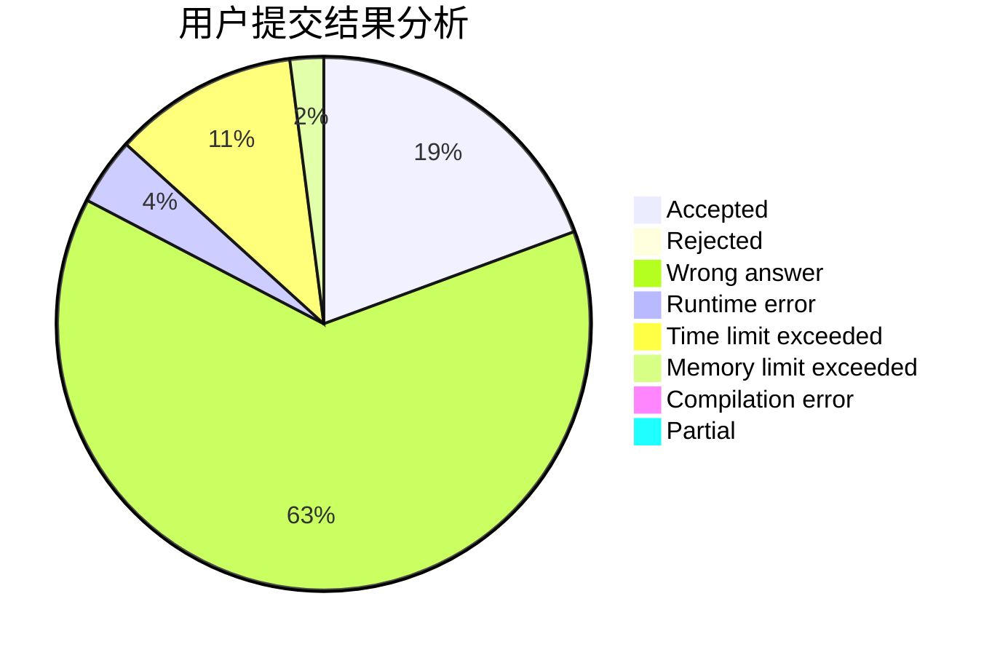
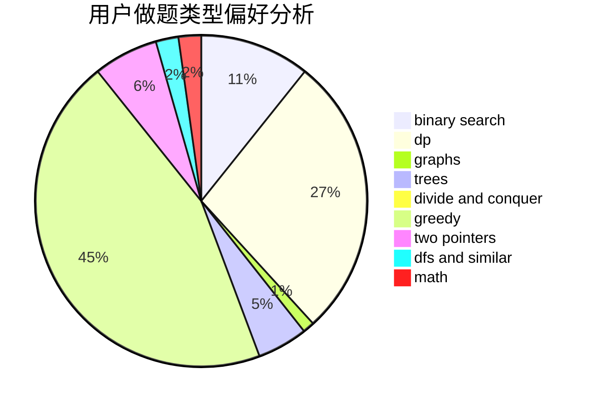

# splay_tree_tag

<!-- tabs:start -->

#### **用户提交结果分析**

#### **用户做题类型偏好分析**

<!-- tabs:end -->
# 推荐题目
[1493B](https://codeforces.com/contest/1493/problem/B)
[1154G](https://codeforces.com/contest/1154/problem/G)
[720D](https://codeforces.com/contest/720/problem/D)
[1278D](https://codeforces.com/contest/1278/problem/D)
[385E](https://codeforces.com/contest/385/problem/E)
[828C](https://codeforces.com/contest/828/problem/C)
[900B](https://codeforces.com/contest/900/problem/B)
[540B](https://codeforces.com/contest/540/problem/B)
[1482H](https://codeforces.com/contest/1482/problem/H)
[518B](https://codeforces.com/contest/518/problem/B)
