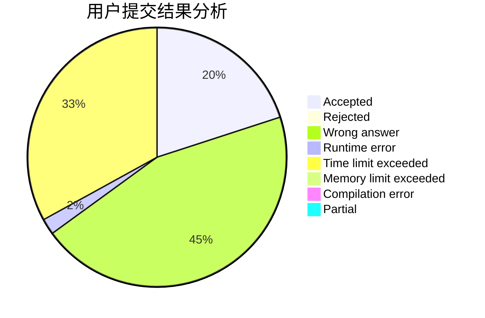
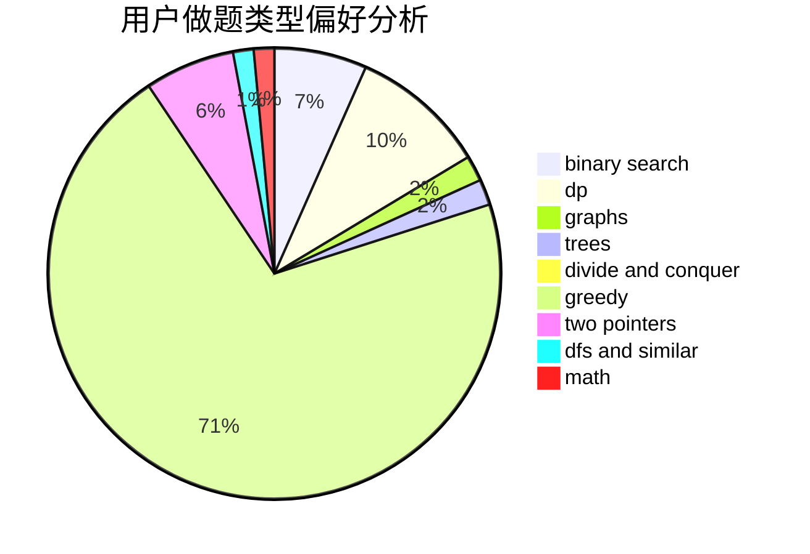

# CN.TTDragon

<!-- tabs:start -->

#### **用户提交结果分析**

#### **用户做题类型偏好分析**

<!-- tabs:end -->
# 推荐题目
[1102B](https://codeforces.com/contest/1102/problem/B)
[615D](https://codeforces.com/contest/615/problem/D)
[277E](https://codeforces.com/contest/277/problem/E)
[294C](https://codeforces.com/contest/294/problem/C)
[279E](https://codeforces.com/contest/279/problem/E)
[620F](https://codeforces.com/contest/620/problem/F)
[608B](https://codeforces.com/contest/608/problem/B)
[217D](https://codeforces.com/contest/217/problem/D)
[621D](https://codeforces.com/contest/621/problem/D)
[621B](https://codeforces.com/contest/621/problem/B)
