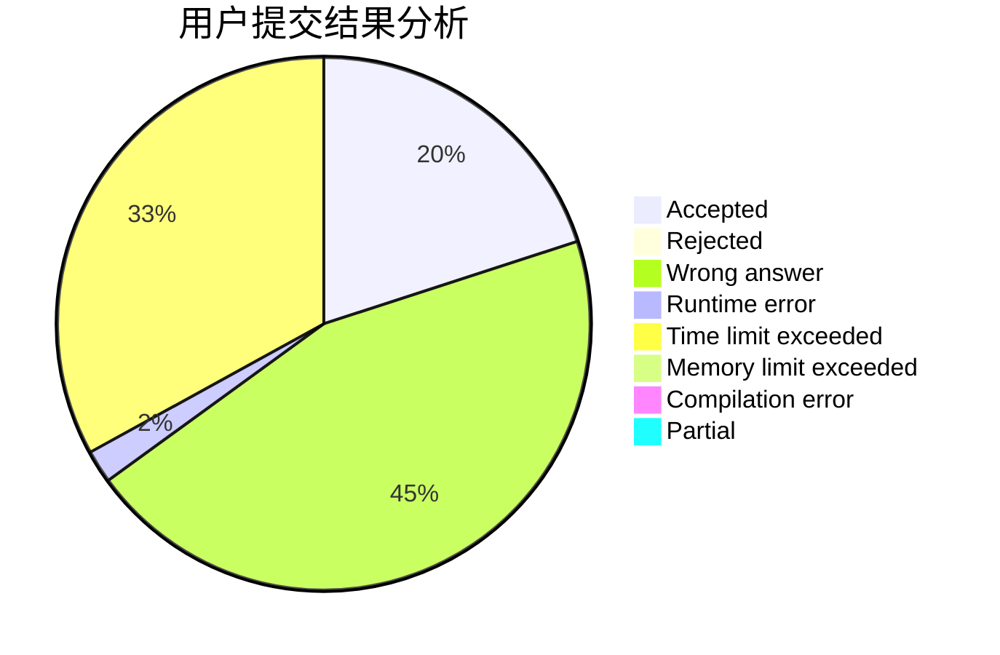
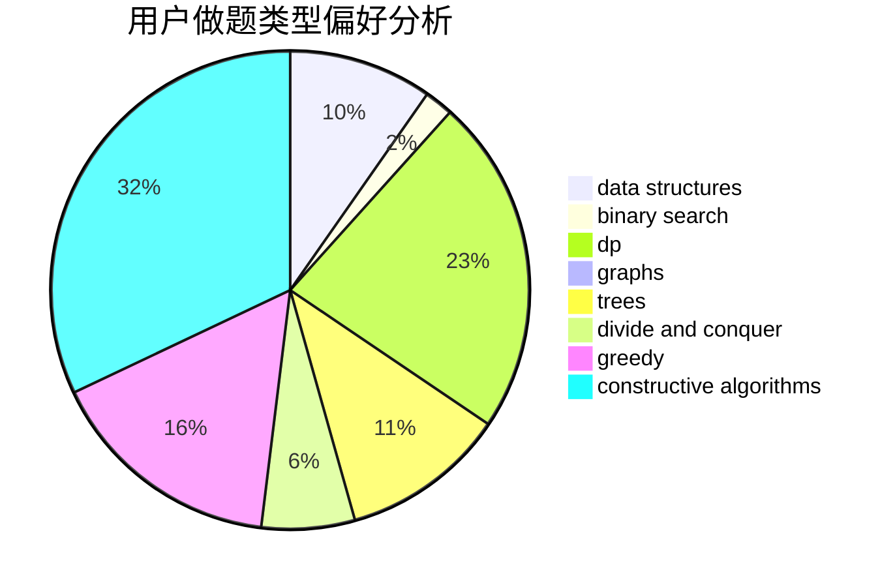

# CN.TTDragon

<!-- tabs:start -->

#### **用户提交结果分析**

#### **用户做题类型偏好分析**

#### **用户错题知识点分析**

<!-- tabs:end -->
# 推荐题目
[1101F](https://codeforces.com/contest/1101/problem/F)		binary search,
                        dp		  
[598A](https://codeforces.com/contest/598/problem/A)		math		  
[25E](https://codeforces.com/contest/25/problem/E)		hashing,
                        strings		  
[279D](https://codeforces.com/contest/279/problem/D)		bitmasks,
                        dp		  
[261B](https://codeforces.com/contest/261/problem/B)		dp,
                        math,
                        probabilities		  
[601D](https://codeforces.com/contest/601/problem/D)		data structures,
                        dfs and similar,
                        dsu,
                        hashing,
                        strings,
                        trees		  
[587F](https://codeforces.com/contest/587/problem/F)		data structures,
                        strings		  
[193D](https://codeforces.com/contest/193/problem/D)		data structures		  
[603A](https://codeforces.com/contest/603/problem/A)		dp,
                        greedy,
                        math		  
[602A](https://codeforces.com/contest/602/problem/A)		brute force,
                        implementation		  
