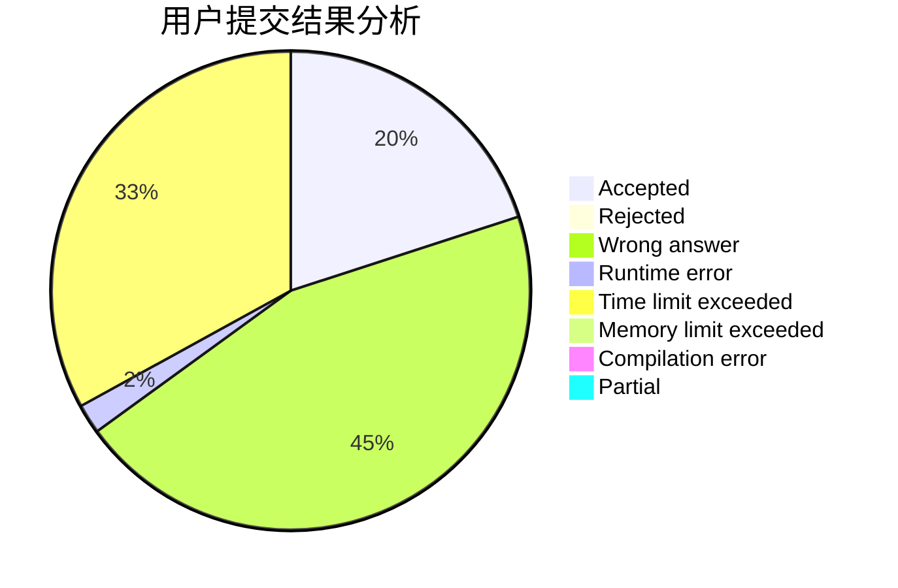
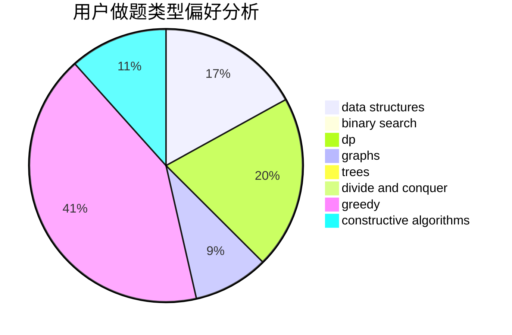

# CN.TTDragon

<!-- tabs:start -->

#### **用户提交结果分析**

#### **用户做题类型偏好分析**

#### **用户错题知识点分析**

<!-- tabs:end -->
# 推荐题目
[1102B](https://codeforces.com/contest/1102/problem/B)		greedy,
                        sortings		  
[615D](https://codeforces.com/contest/615/problem/D)		math,
                        number theory		  
[277E](https://codeforces.com/contest/277/problem/E)		flows,
                        trees		  
[294C](https://codeforces.com/contest/294/problem/C)		combinatorics,
                        number theory		  
[279E](https://codeforces.com/contest/279/problem/E)		dp,
                        games,
                        greedy,
                        number theory		  
[620F](https://codeforces.com/contest/620/problem/F)		data structures,
                        strings,
                        trees		  
[608B](https://codeforces.com/contest/608/problem/B)		combinatorics,
                        strings		  
[217D](https://codeforces.com/contest/217/problem/D)		bitmasks,
                        brute force,
                        combinatorics,
                        dfs and similar,
                        math		  
[621D](https://codeforces.com/contest/621/problem/D)		brute force,
                        constructive algorithms,
                        math		  
[621B](https://codeforces.com/contest/621/problem/B)		combinatorics,
                        implementation		  
