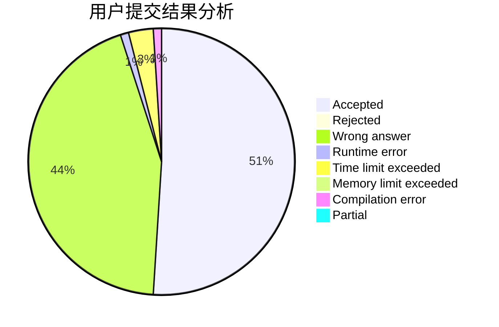
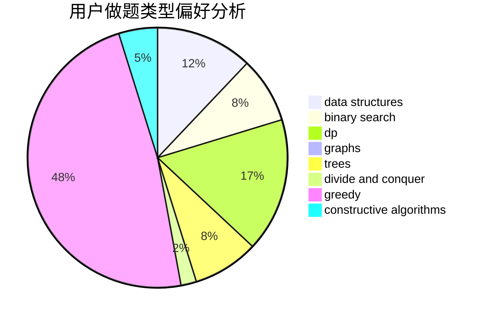
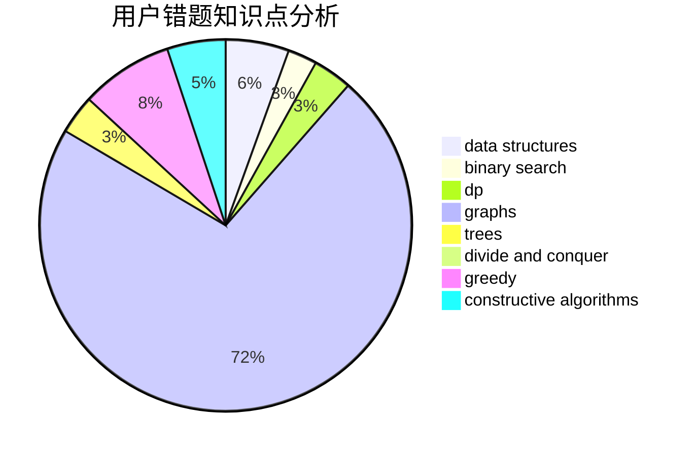

# spnooyseed

<!-- tabs:start -->

#### **用户提交结果分析**

#### **用户做题类型偏好分析**

#### **用户错题知识点分析**

<!-- tabs:end -->
# 推荐题目
[277E](https://codeforces.com/contest/277/problem/E)		flows,
                        trees		  
[1033B](https://codeforces.com/contest/1033/problem/B)		math,
                        number theory		  
[656E](https://codeforces.com/contest/656/problem/E)		*special problem		  
[1159C](https://codeforces.com/contest/1159/problem/C)		dsu,graphs,sortings,trees		  
[1145C](https://codeforces.com/contest/1145/problem/C)		bitmasks,
                        brute force		  
[1374A](https://codeforces.com/contest/1374/problem/A)		math		  
[1260E](https://codeforces.com/contest/1260/problem/E)		brute force,
                        dp,
                        greedy		  
[909E](https://codeforces.com/contest/909/problem/E)		dfs and similar,
                        dp,
                        graphs,
                        greedy		  
[1058C](https://codeforces.com/contest/1058/problem/C)		dsu,graphs,sortings,trees		  
[786E](https://codeforces.com/contest/786/problem/E)		data structures,
                        flows,
                        graphs,
                        trees		  
