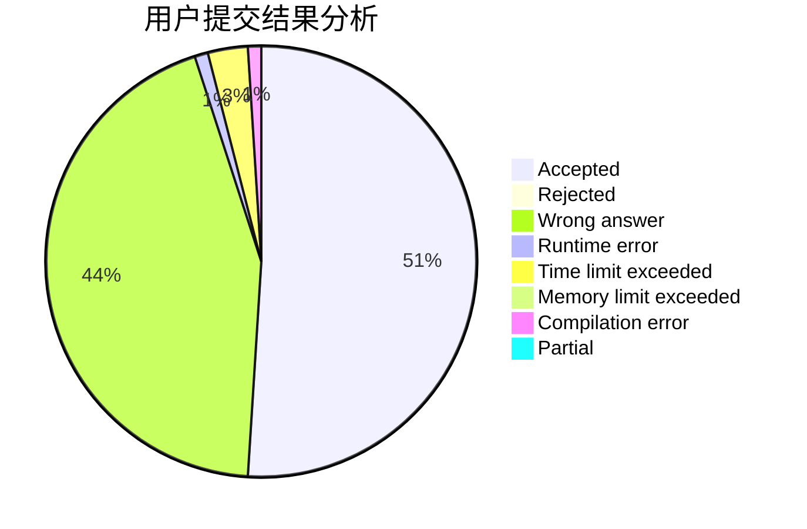
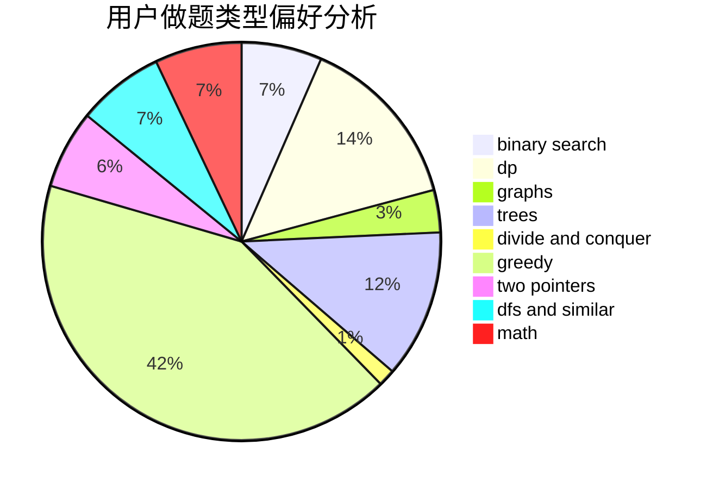

# spnooyseed

<!-- tabs:start -->

#### **用户提交结果分析**

#### **用户做题类型偏好分析**

<!-- tabs:end -->
# 推荐题目
[277E](https://codeforces.com/contest/277/problem/E)
[1033B](https://codeforces.com/contest/1033/problem/B)
[656E](https://codeforces.com/contest/656/problem/E)
[1159C](https://codeforces.com/contest/1159/problem/C)
[1145C](https://codeforces.com/contest/1145/problem/C)
[1374A](https://codeforces.com/contest/1374/problem/A)
[1260E](https://codeforces.com/contest/1260/problem/E)
[909E](https://codeforces.com/contest/909/problem/E)
[1058C](https://codeforces.com/contest/1058/problem/C)
[786E](https://codeforces.com/contest/786/problem/E)
