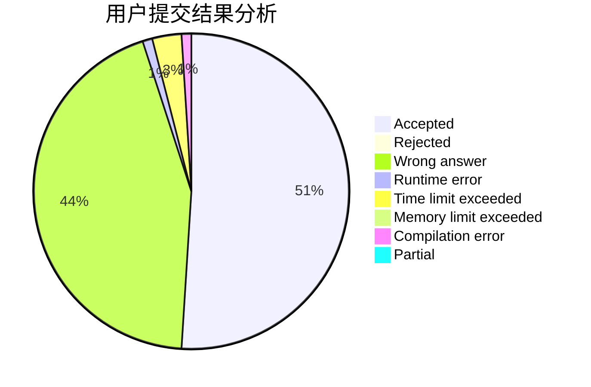
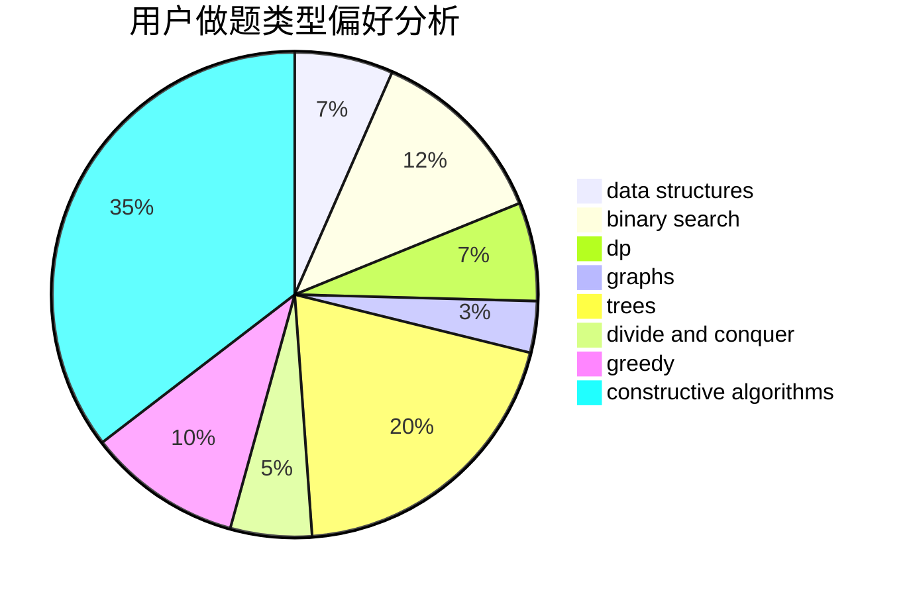
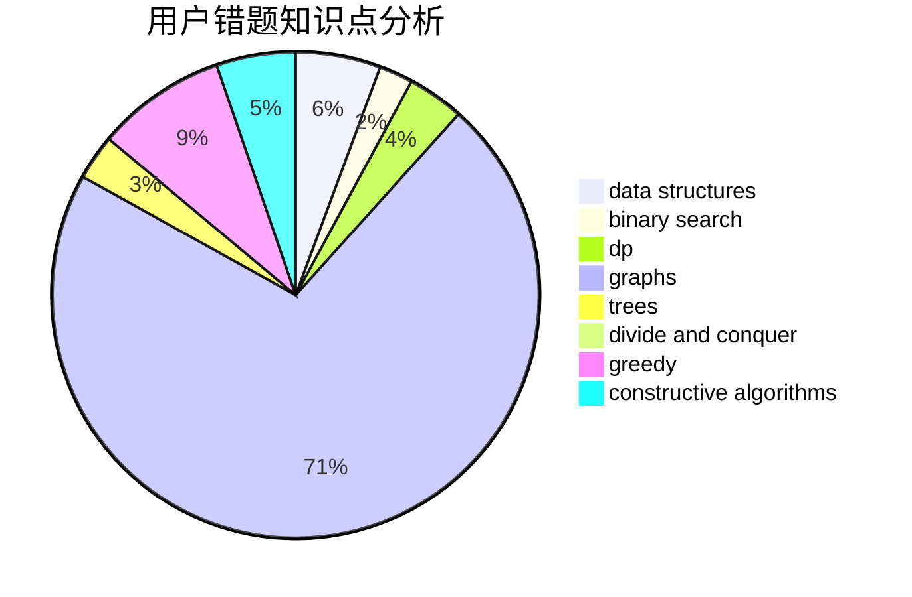

# spnooyseed

<!-- tabs:start -->

#### **用户提交结果分析**

#### **用户做题类型偏好分析**

#### **用户错题知识点分析**

<!-- tabs:end -->
# 推荐题目
[25E](https://codeforces.com/contest/25/problem/E)		hashing,
                        strings		  
[1032E](https://codeforces.com/contest/1032/problem/E)		dp,
                        math		  
[628D](https://codeforces.com/contest/628/problem/D)		dp		  
[1157C1](https://codeforces.com/contest/1157C/problem/1)		greedy		  
[1143C](https://codeforces.com/contest/1143/problem/C)		dfs and similar,
                        trees		  
[1367D](https://codeforces.com/contest/1367/problem/D)		constructive algorithms,
                        greedy,
                        implementation,
                        sortings		  
[1253C](https://codeforces.com/contest/1253/problem/C)		dp,
                        greedy,
                        math,
                        sortings		  
[891A](https://codeforces.com/contest/891/problem/A)		brute force,
                        dp,
                        greedy,
                        math,
                        number theory		  
[1057B](https://codeforces.com/contest/1057/problem/B)		*special problem,
                        brute force		  
[767C](https://codeforces.com/contest/767/problem/C)		dfs and similar,
                        graphs,
                        greedy,
                        trees		  
