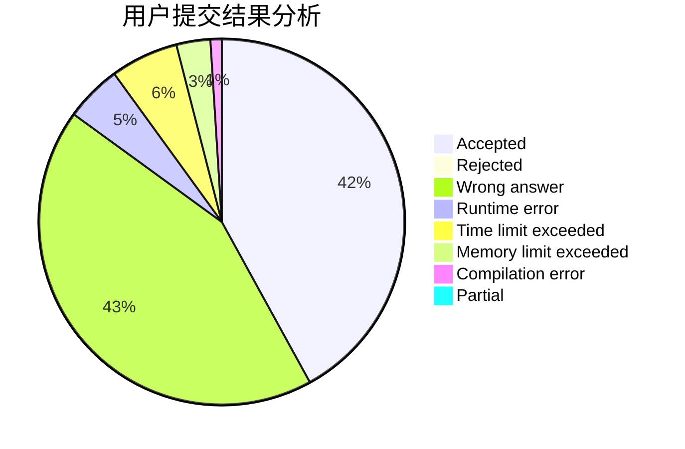
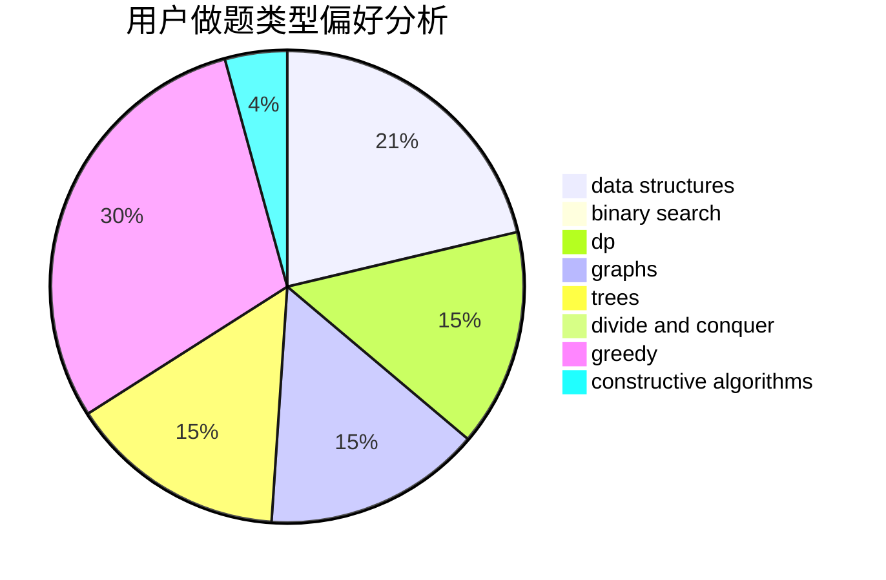
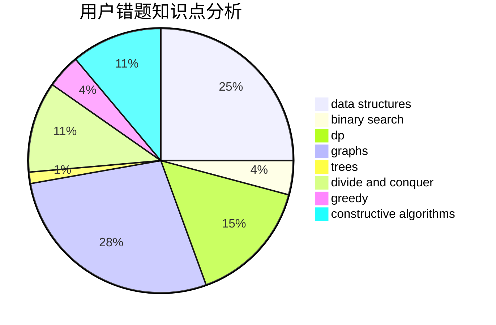

# spy20051623

<!-- tabs:start -->

#### **用户提交结果分析**

#### **用户做题类型偏好分析**

#### **用户错题知识点分析**

<!-- tabs:end -->
# 推荐题目
[913H](https://codeforces.com/contest/913/problem/H)		math,
                        probabilities		  
[906A](https://codeforces.com/contest/906/problem/A)		implementation,
                        strings		  
[190E](https://codeforces.com/contest/190/problem/E)		data structures,
                        dsu,
                        graphs,
                        hashing,
                        sortings		  
[566G](https://codeforces.com/contest/566/problem/G)		geometry		  
[847F](https://codeforces.com/contest/847/problem/F)		greedy,
                        sortings		  
[493D](https://codeforces.com/contest/493/problem/D)		constructive algorithms,
                        games,
                        math		  
[754E](https://codeforces.com/contest/754/problem/E)		bitmasks,
                        brute force,
                        fft,
                        strings,
                        trees		  
[825G](https://codeforces.com/contest/825/problem/G)		dfs and similar,
                        graphs,
                        trees		  
[1295F](https://codeforces.com/contest/1295/problem/F)		combinatorics,
                        dp,
                        probabilities		  
[1082G](https://codeforces.com/contest/1082/problem/G)		flows,
                        graphs		  
