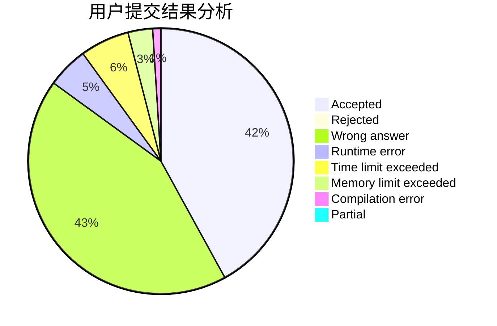
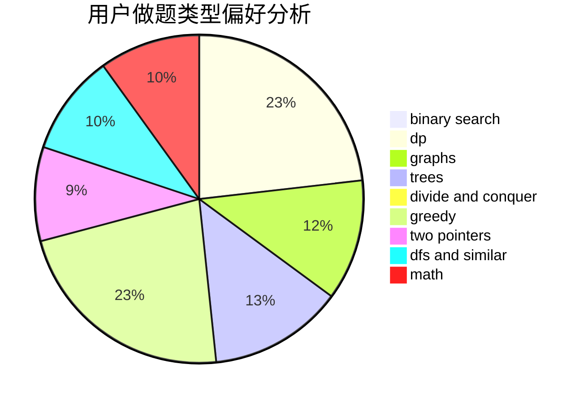

# spy20051623

<!-- tabs:start -->

#### **用户提交结果分析**

#### **用户做题类型偏好分析**

<!-- tabs:end -->
# 推荐题目
[913H](https://codeforces.com/contest/913/problem/H)
[906A](https://codeforces.com/contest/906/problem/A)
[190E](https://codeforces.com/contest/190/problem/E)
[566G](https://codeforces.com/contest/566/problem/G)
[847F](https://codeforces.com/contest/847/problem/F)
[493D](https://codeforces.com/contest/493/problem/D)
[754E](https://codeforces.com/contest/754/problem/E)
[825G](https://codeforces.com/contest/825/problem/G)
[1295F](https://codeforces.com/contest/1295/problem/F)
[1082G](https://codeforces.com/contest/1082/problem/G)
