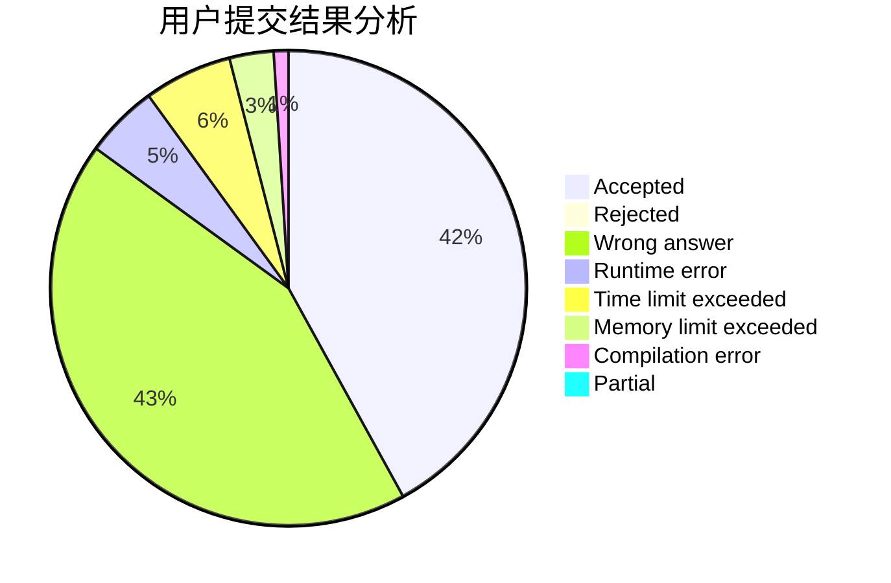
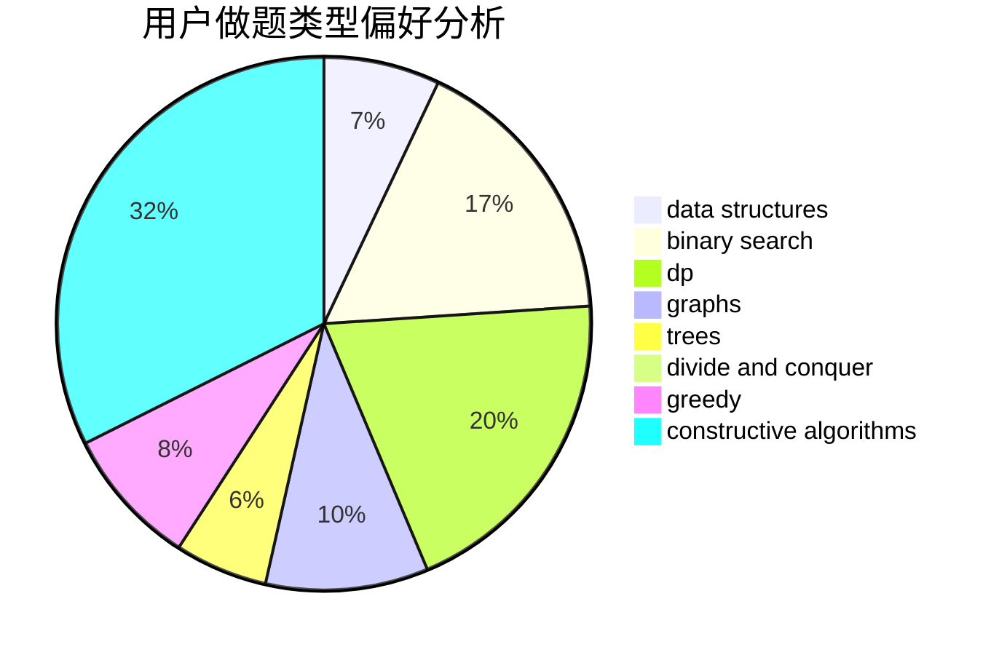
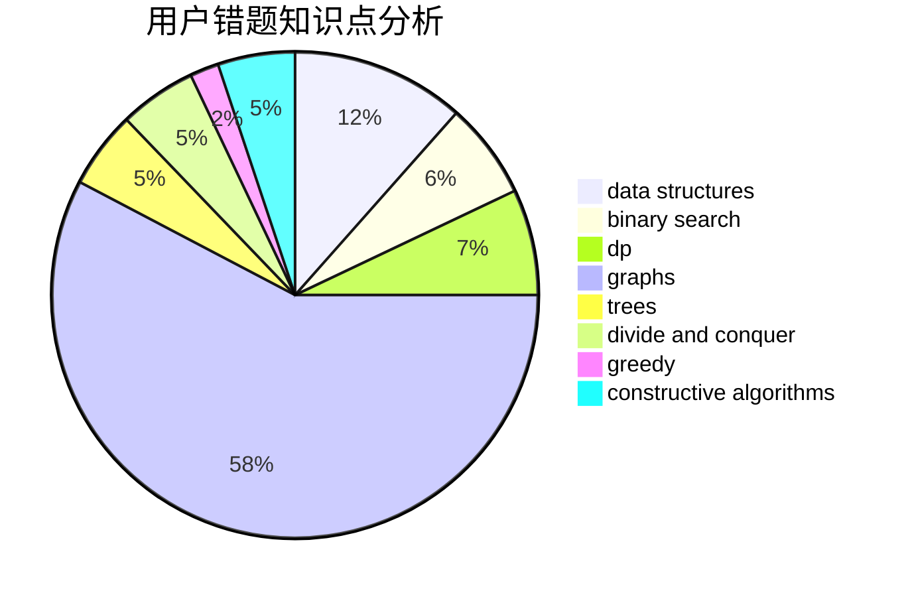

# spy20051623

<!-- tabs:start -->

#### **用户提交结果分析**

#### **用户做题类型偏好分析**

#### **用户错题知识点分析**

<!-- tabs:end -->
# 推荐题目
[896E](https://codeforces.com/contest/896/problem/E)		data structures,
                        dsu		  
[886F](https://codeforces.com/contest/886/problem/F)		geometry		  
[165E](https://codeforces.com/contest/165/problem/E)		bitmasks,
                        brute force,
                        dfs and similar,
                        dp		  
[542D](https://codeforces.com/contest/542/problem/D)		dfs and similar,
                        dp,
                        hashing,
                        math,
                        number theory		  
[82A](https://codeforces.com/contest/82/problem/A)		implementation,
                        math		  
[474E](https://codeforces.com/contest/474/problem/E)		binary search,
                        data structures,
                        dp,
                        sortings,
                        trees		  
[734C](https://codeforces.com/contest/734/problem/C)		binary search,
                        dp,
                        greedy,
                        two pointers		  
[809A](https://codeforces.com/contest/809/problem/A)		implementation,
                        math,
                        sortings		  
[1288D](https://codeforces.com/contest/1288/problem/D)		binary search,
                        bitmasks,
                        dp		  
[1082D](https://codeforces.com/contest/1082/problem/D)		constructive algorithms,
                        graphs,
                        implementation		  
