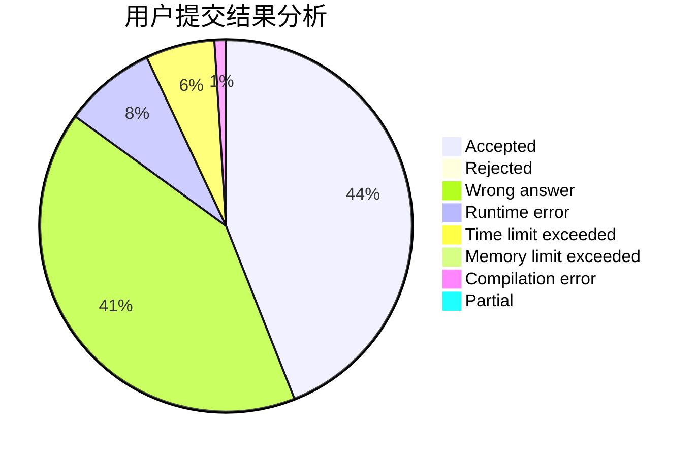
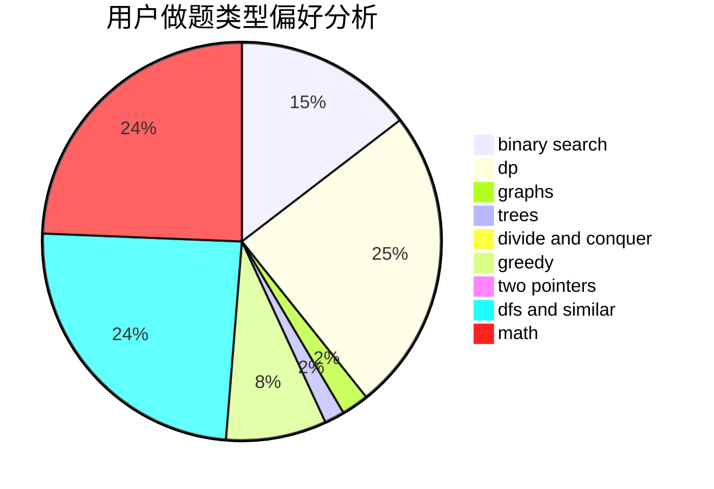

# sry_

<!-- tabs:start -->

#### **用户提交结果分析**

#### **用户做题类型偏好分析**

<!-- tabs:end -->
# 推荐题目
[1490G](https://codeforces.com/contest/1490/problem/G)
[13711](https://codeforces.com/contest/1371/problem/1)
[482A](https://codeforces.com/contest/482/problem/A)
[504A](https://codeforces.com/contest/504/problem/A)
[663E](https://codeforces.com/contest/663/problem/E)
[334B](https://codeforces.com/contest/334/problem/B)
[639D](https://codeforces.com/contest/639/problem/D)
[263E](https://codeforces.com/contest/263/problem/E)
[449D](https://codeforces.com/contest/449/problem/D)
[1144G](https://codeforces.com/contest/1144/problem/G)
