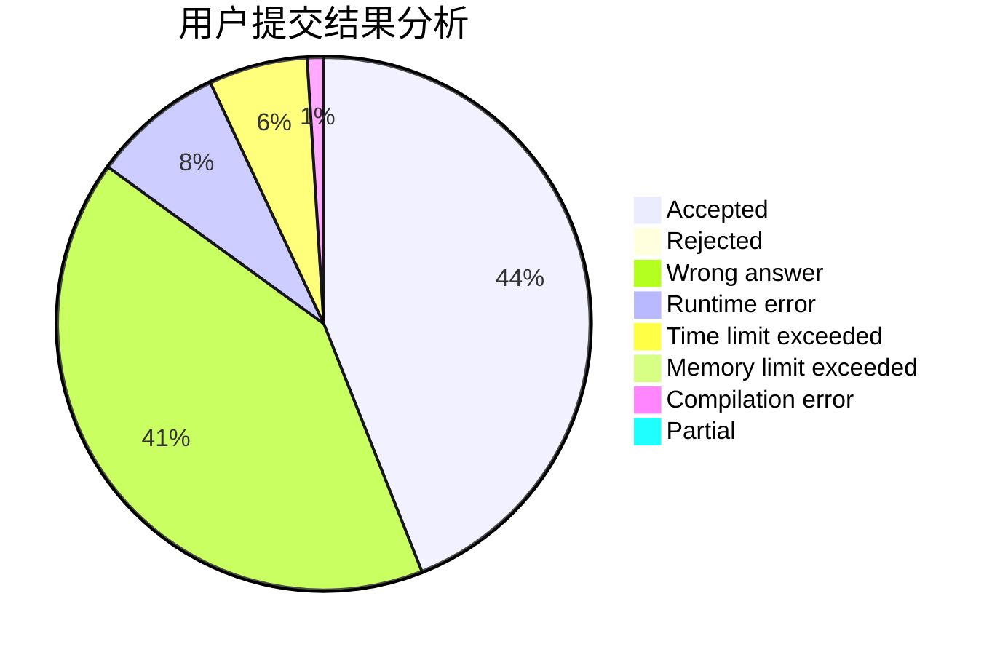
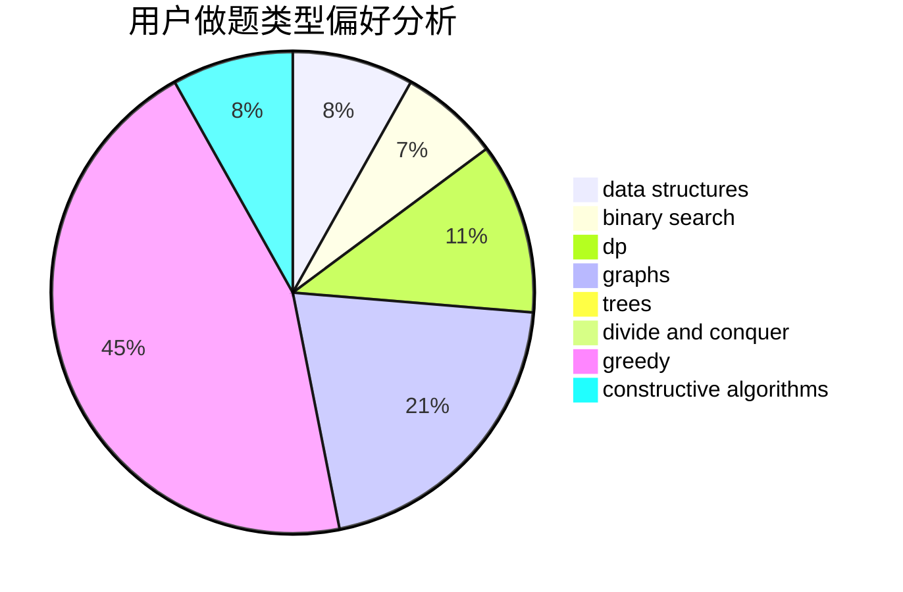

# sry_

<!-- tabs:start -->

#### **用户提交结果分析**

#### **用户做题类型偏好分析**

#### **用户错题知识点分析**

<!-- tabs:end -->
# 推荐题目
[1483B](https://codeforces.com/contest/1483/problem/B)		dsu,graphs,sortings,trees		  
[1364A](https://codeforces.com/contest/1364/problem/A)		brute force,
                        data structures,
                        number theory,
                        two pointers		  
[462A](https://codeforces.com/contest/462/problem/A)		brute force,
                        implementation		  
[483B](https://codeforces.com/contest/483/problem/B)		binary search,
                        math		  
[632C](https://codeforces.com/contest/632/problem/C)		sortings,
                        strings		  
[311B](https://codeforces.com/contest/311/problem/B)		data structures,
                        dp		  
[618E](https://codeforces.com/contest/618/problem/E)		data structures,
                        geometry		  
[242E](https://codeforces.com/contest/242/problem/E)		bitmasks,
                        data structures		  
[426B](https://codeforces.com/contest/426/problem/B)		implementation		  
[1142E](https://codeforces.com/contest/1142/problem/E)		graphs,
                        interactive		  
