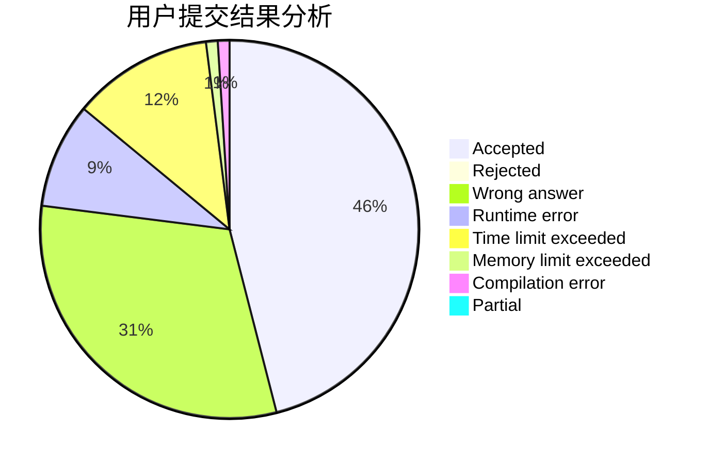
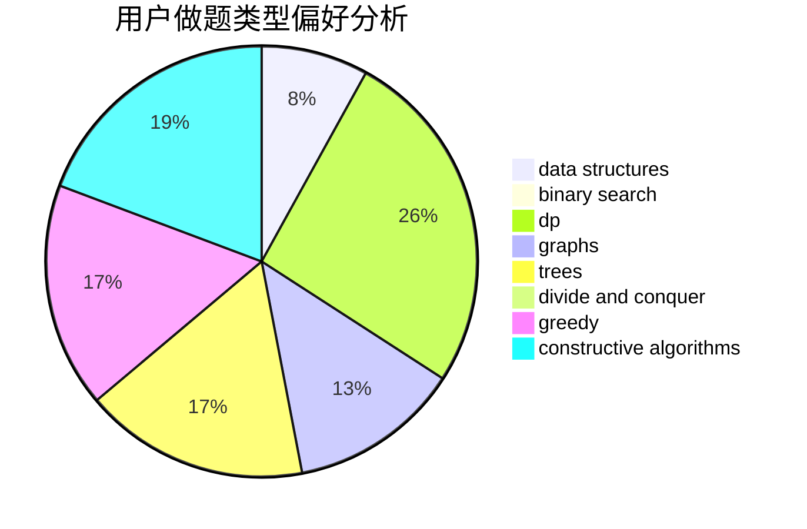
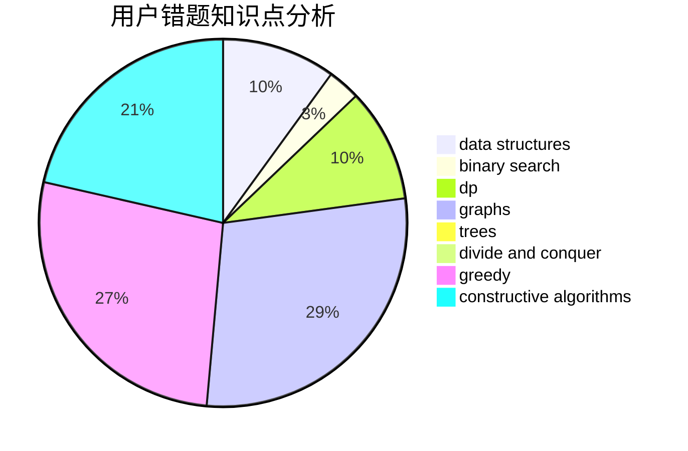

# ssl_wyc

<!-- tabs:start -->

#### **用户提交结果分析**

#### **用户做题类型偏好分析**

#### **用户错题知识点分析**

<!-- tabs:end -->
# 推荐题目
[804C](https://codeforces.com/contest/804/problem/C)		constructive algorithms,
                        dfs and similar,
                        greedy		  
[1347C](https://codeforces.com/contest/1347/problem/C)		dsu,graphs,sortings,trees		  
[1073A](https://codeforces.com/contest/1073/problem/A)		implementation,
                        strings		  
[965E](https://codeforces.com/contest/965/problem/E)		data structures,
                        dp,
                        greedy,
                        strings,
                        trees		  
[651D](https://codeforces.com/contest/651/problem/D)		dsu,graphs,sortings,trees		  
[1357D5](https://codeforces.com/contest/1357D/problem/5)		nan		  
[226E](https://codeforces.com/contest/226/problem/E)		data structures,
                        trees		  
[1234F](https://codeforces.com/contest/1234/problem/F)		bitmasks,
                        dp		  
[48A](https://codeforces.com/contest/48/problem/A)		implementation,
                        schedules		  
[1081A](https://codeforces.com/contest/1081/problem/A)		constructive algorithms,
                        math		  
