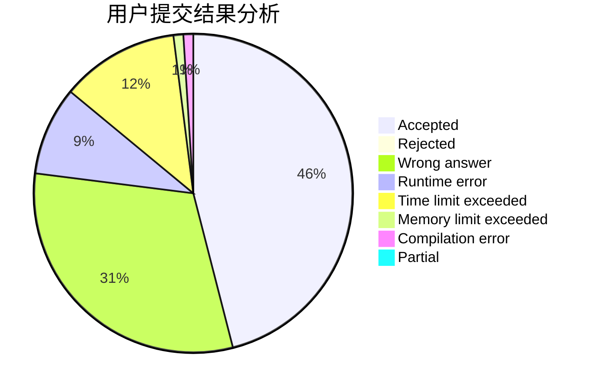
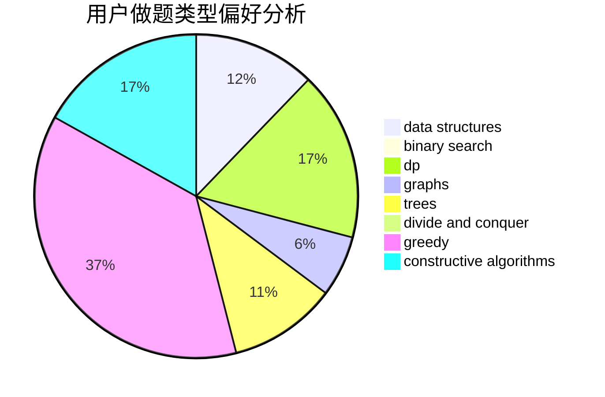

# ssl_wyc

<!-- tabs:start -->

#### **用户提交结果分析**

#### **用户做题类型偏好分析**

#### **用户错题知识点分析**

<!-- tabs:end -->
# 推荐题目
[820B](https://codeforces.com/contest/820/problem/B)		constructive algorithms,
                        geometry,
                        math		  
[1354B](https://codeforces.com/contest/1354/problem/B)		binary search,
                        dp,
                        implementation,
                        two pointers		  
[1073D](https://codeforces.com/contest/1073/problem/D)		binary search,
                        brute force,
                        data structures,
                        greedy		  
[987E](https://codeforces.com/contest/987/problem/E)		dsu,graphs,sortings,trees		  
[675D](https://codeforces.com/contest/675/problem/D)		data structures,
                        trees		  
[1365G](https://codeforces.com/contest/1365/problem/G)		bitmasks,
                        combinatorics,
                        constructive algorithms,
                        interactive,
                        math		  
[246A](https://codeforces.com/contest/246/problem/A)		constructive algorithms,
                        greedy,
                        sortings		  
[1240C](https://codeforces.com/contest/1240/problem/C)		dsu,graphs,sortings,trees		  
[50E](https://codeforces.com/contest/50/problem/E)		math		  
[1081D](https://codeforces.com/contest/1081/problem/D)		dsu,
                        graphs,
                        shortest paths,
                        sortings		  
