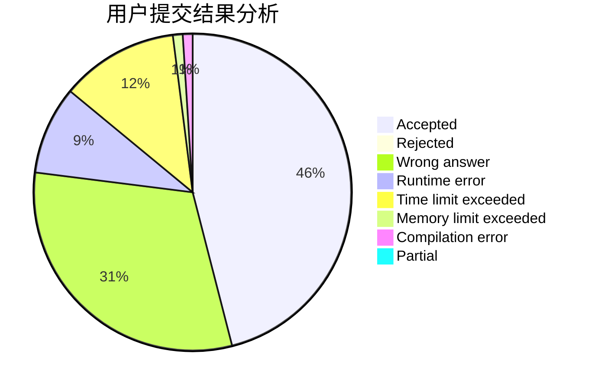
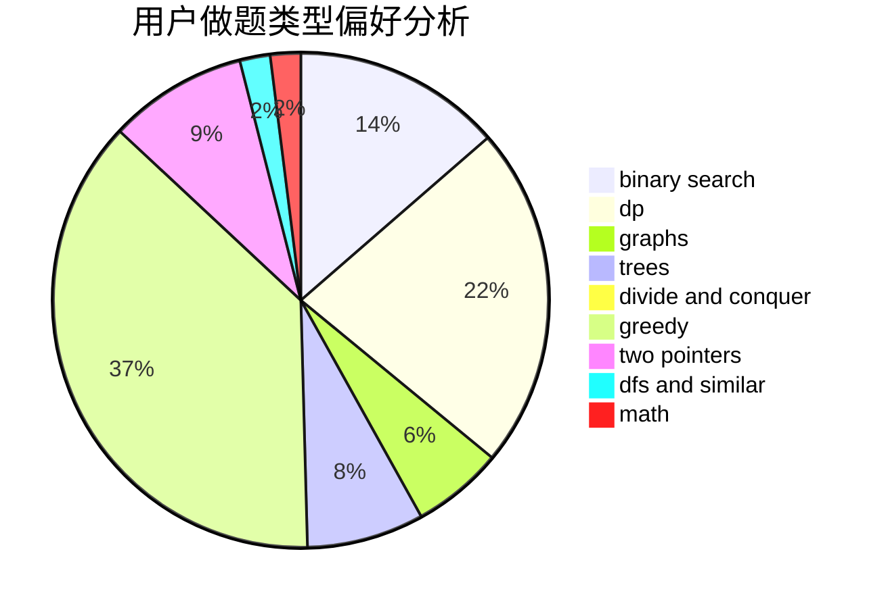

# ssl_wyc

<!-- tabs:start -->

#### **用户提交结果分析**

#### **用户做题类型偏好分析**

<!-- tabs:end -->
# 推荐题目
[820B](https://codeforces.com/contest/820/problem/B)
[1354B](https://codeforces.com/contest/1354/problem/B)
[1073D](https://codeforces.com/contest/1073/problem/D)
[987E](https://codeforces.com/contest/987/problem/E)
[675D](https://codeforces.com/contest/675/problem/D)
[1365G](https://codeforces.com/contest/1365/problem/G)
[246A](https://codeforces.com/contest/246/problem/A)
[1240C](https://codeforces.com/contest/1240/problem/C)
[50E](https://codeforces.com/contest/50/problem/E)
[1081D](https://codeforces.com/contest/1081/problem/D)
