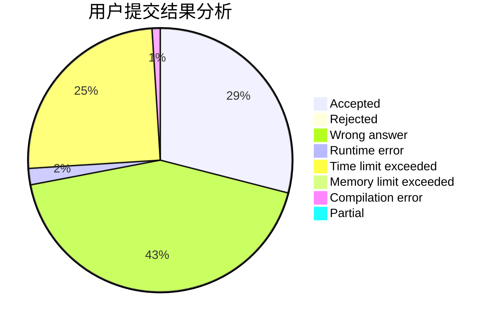
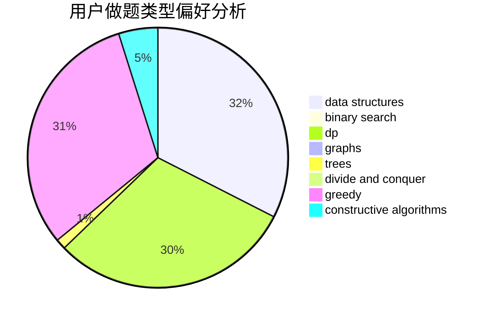
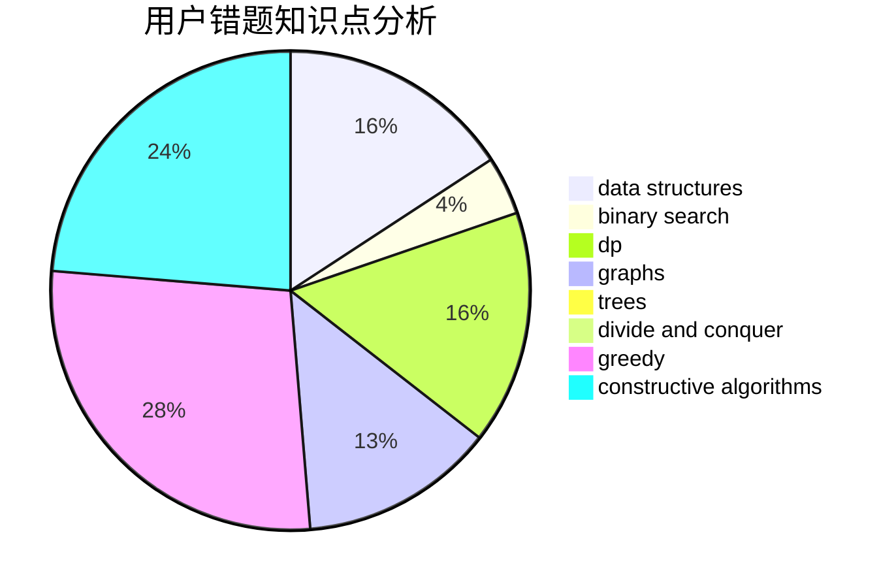

# ssyze

<!-- tabs:start -->

#### **用户提交结果分析**

#### **用户做题类型偏好分析**

#### **用户错题知识点分析**

<!-- tabs:end -->
# 推荐题目
[acmsguru2](https://codeforces.com/contest/acmsguru/problem/2)		dsu,graphs,sortings,trees		  
[928B](https://codeforces.com/contest/928/problem/B)		*special problem,
                        dp		  
[497E](https://codeforces.com/contest/497/problem/E)		dp,
                        matrices		  
[34D](https://codeforces.com/contest/34/problem/D)		dfs and similar,
                        graphs		  
[722C](https://codeforces.com/contest/722/problem/C)		data structures,
                        dsu		  
[908C](https://codeforces.com/contest/908/problem/C)		brute force,
                        geometry,
                        implementation,
                        math		  
[1031A](https://codeforces.com/contest/1031/problem/A)		implementation,
                        math		  
[1250H](https://codeforces.com/contest/1250/problem/H)		math		  
[1345F](https://codeforces.com/contest/1345/problem/F)		dsu,graphs,sortings,trees		  
[660C](https://codeforces.com/contest/660/problem/C)		binary search,
                        dp,
                        two pointers		  
