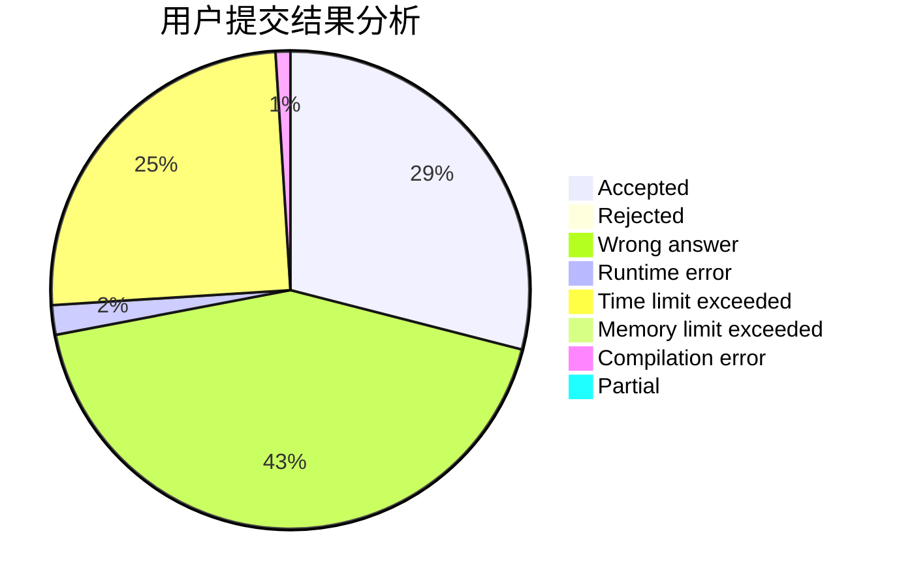
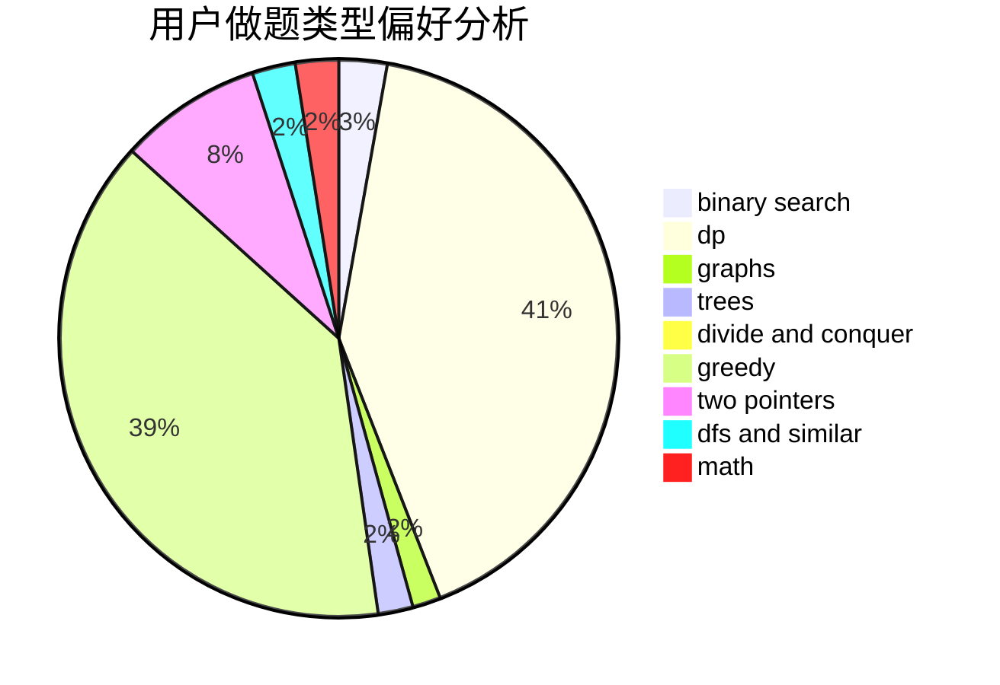

# ssyze

<!-- tabs:start -->

#### **用户提交结果分析**

#### **用户做题类型偏好分析**

<!-- tabs:end -->
# 推荐题目
[acmsguru2](https://codeforces.com/contest/acmsguru/problem/2)
[928B](https://codeforces.com/contest/928/problem/B)
[497E](https://codeforces.com/contest/497/problem/E)
[34D](https://codeforces.com/contest/34/problem/D)
[722C](https://codeforces.com/contest/722/problem/C)
[908C](https://codeforces.com/contest/908/problem/C)
[1031A](https://codeforces.com/contest/1031/problem/A)
[1250H](https://codeforces.com/contest/1250/problem/H)
[1345F](https://codeforces.com/contest/1345/problem/F)
[660C](https://codeforces.com/contest/660/problem/C)
