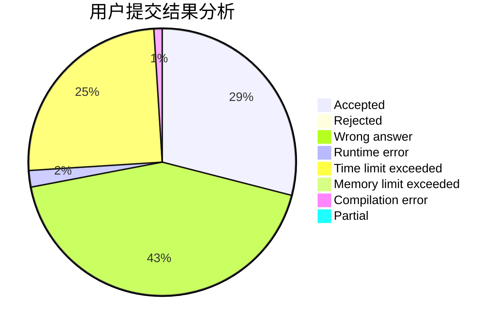
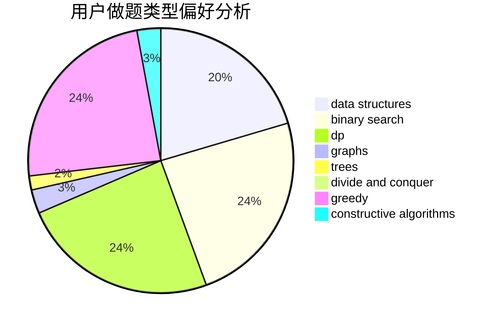
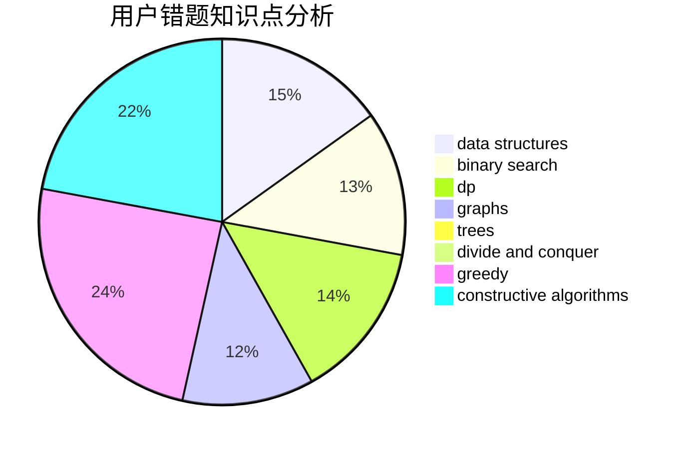

# ssyze

<!-- tabs:start -->

#### **用户提交结果分析**

#### **用户做题类型偏好分析**

#### **用户错题知识点分析**

<!-- tabs:end -->
# 推荐题目
[985G](https://codeforces.com/contest/985/problem/G)		combinatorics		  
[911C](https://codeforces.com/contest/911/problem/C)		brute force,
                        constructive algorithms		  
[477E](https://codeforces.com/contest/477/problem/E)		data structures		  
[319D](https://codeforces.com/contest/319/problem/D)		greedy,
                        hashing,
                        string suffix structures,
                        strings		  
[703B](https://codeforces.com/contest/703/problem/B)		implementation,
                        math		  
[888E](https://codeforces.com/contest/888/problem/E)		bitmasks,
                        divide and conquer,
                        meet-in-the-middle		  
[1030D](https://codeforces.com/contest/1030/problem/D)		geometry,
                        number theory		  
[1245F](https://codeforces.com/contest/1245/problem/F)		bitmasks,
                        brute force,
                        combinatorics,
                        dp		  
[1338E](https://codeforces.com/contest/1338/problem/E)		graphs		  
[630G](https://codeforces.com/contest/630/problem/G)		combinatorics,
                        math		  
