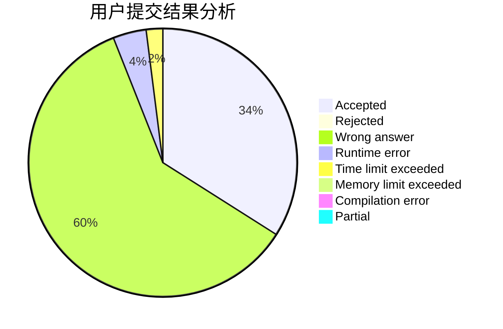
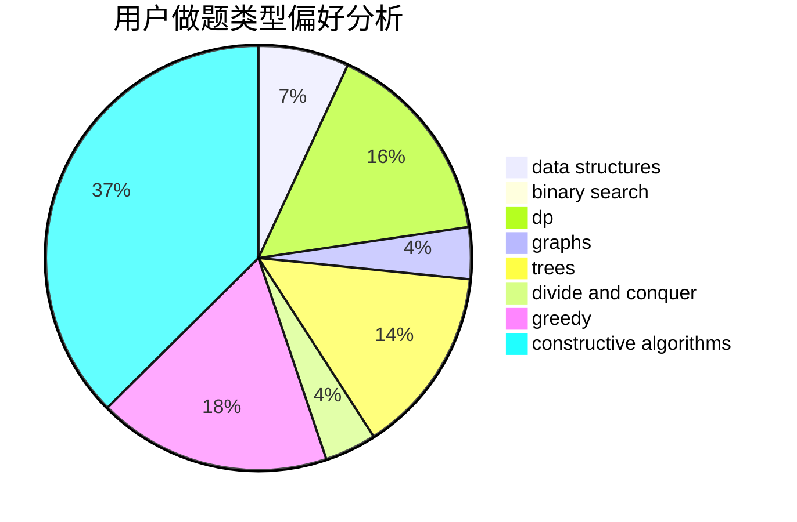
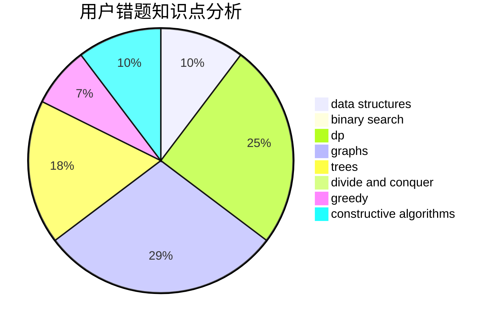

# st1v3n

<!-- tabs:start -->

#### **用户提交结果分析**

#### **用户做题类型偏好分析**

#### **用户错题知识点分析**

<!-- tabs:end -->
# 推荐题目
[1100A](https://codeforces.com/contest/1100/problem/A)		implementation		  
[455A](https://codeforces.com/contest/455/problem/A)		dp		  
[759B](https://codeforces.com/contest/759/problem/B)		dsu,graphs,sortings,trees		  
[834B](https://codeforces.com/contest/834/problem/B)		data structures,
                        implementation		  
[886A](https://codeforces.com/contest/886/problem/A)		brute force		  
[199B](https://codeforces.com/contest/199/problem/B)		geometry		  
[235A](https://codeforces.com/contest/235/problem/A)		number theory		  
[984A](https://codeforces.com/contest/984/problem/A)		sortings		  
[574C](https://codeforces.com/contest/574/problem/C)		dsu,graphs,sortings,trees		  
[1341F](https://codeforces.com/contest/1341/problem/F)		dsu,graphs,sortings,trees		  
