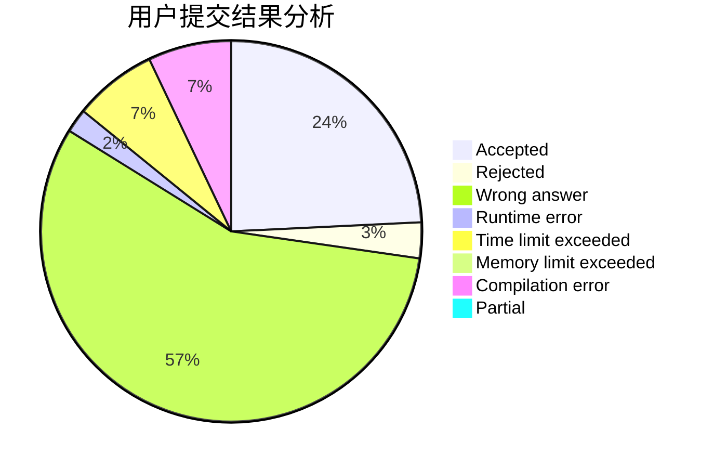
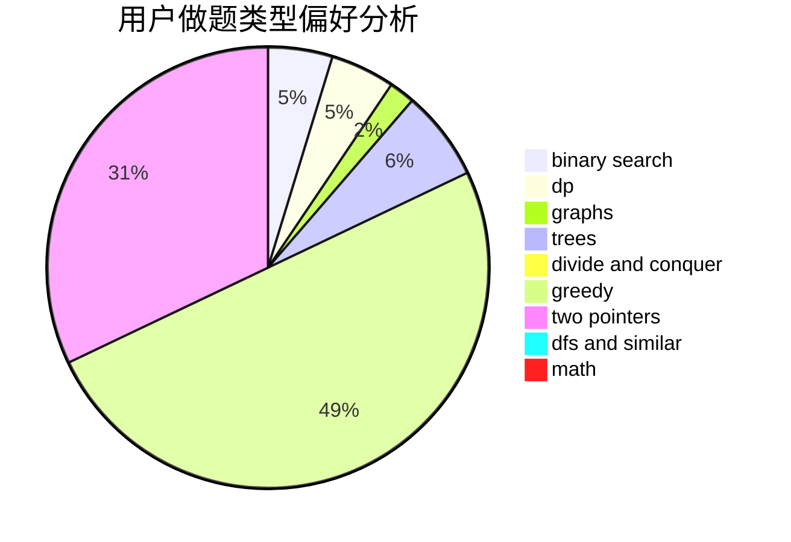

# star_xingchen_c

<!-- tabs:start -->

#### **用户提交结果分析**

#### **用户做题类型偏好分析**

<!-- tabs:end -->
# 推荐题目
[1060D](https://codeforces.com/contest/1060/problem/D)
[1081D](https://codeforces.com/contest/1081/problem/D)
[335F](https://codeforces.com/contest/335/problem/F)
[198E](https://codeforces.com/contest/198/problem/E)
[608C](https://codeforces.com/contest/608/problem/C)
[1321E](https://codeforces.com/contest/1321/problem/E)
[1254D](https://codeforces.com/contest/1254/problem/D)
[1490C](https://codeforces.com/contest/1490/problem/C)
[1497B](https://codeforces.com/contest/1497/problem/B)
[1491C](https://codeforces.com/contest/1491/problem/C)
