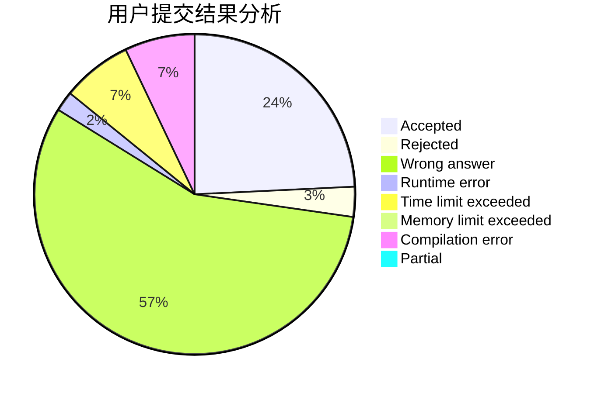
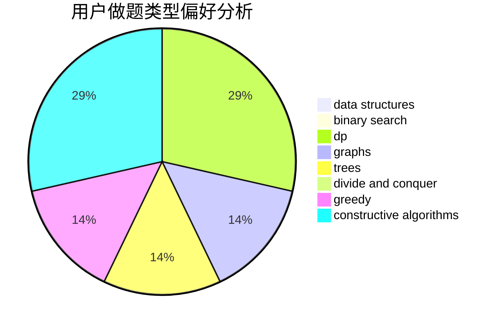
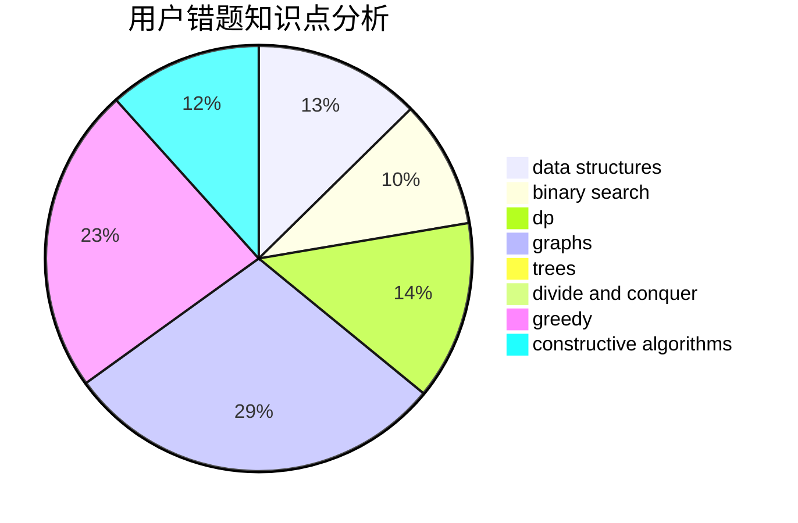

# star_xingchen_c

<!-- tabs:start -->

#### **用户提交结果分析**

#### **用户做题类型偏好分析**

#### **用户错题知识点分析**

<!-- tabs:end -->
# 推荐题目
[1060A](https://codeforces.com/contest/1060/problem/A)		brute force		  
[1081A](https://codeforces.com/contest/1081/problem/A)		constructive algorithms,
                        math		  
[312A](https://codeforces.com/contest/312/problem/A)		implementation,
                        strings		  
[171D](https://codeforces.com/contest/171/problem/D)		*special problem,
                        brute force		  
[588A](https://codeforces.com/contest/588/problem/A)		greedy		  
[1312C](https://codeforces.com/contest/1312/problem/C)		bitmasks,
                        greedy,
                        implementation,
                        math,
                        number theory,
                        ternary search		  
[1250E](https://codeforces.com/contest/1250/problem/E)		graphs,
                        implementation		  
[1482E](https://codeforces.com/contest/1482/problem/E)		data structures,
                        divide and conquer,
                        dp		  
[1489D](https://codeforces.com/contest/1489/problem/D)		dsu,graphs,sortings,trees		  
[1483E](https://codeforces.com/contest/1483/problem/E)		dsu,graphs,sortings,trees		  
