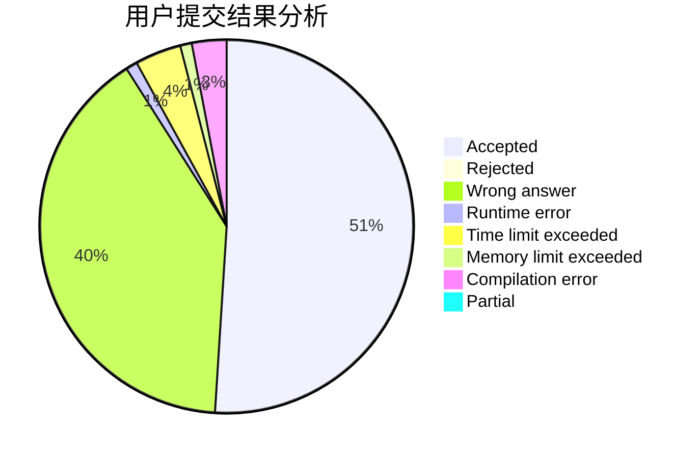
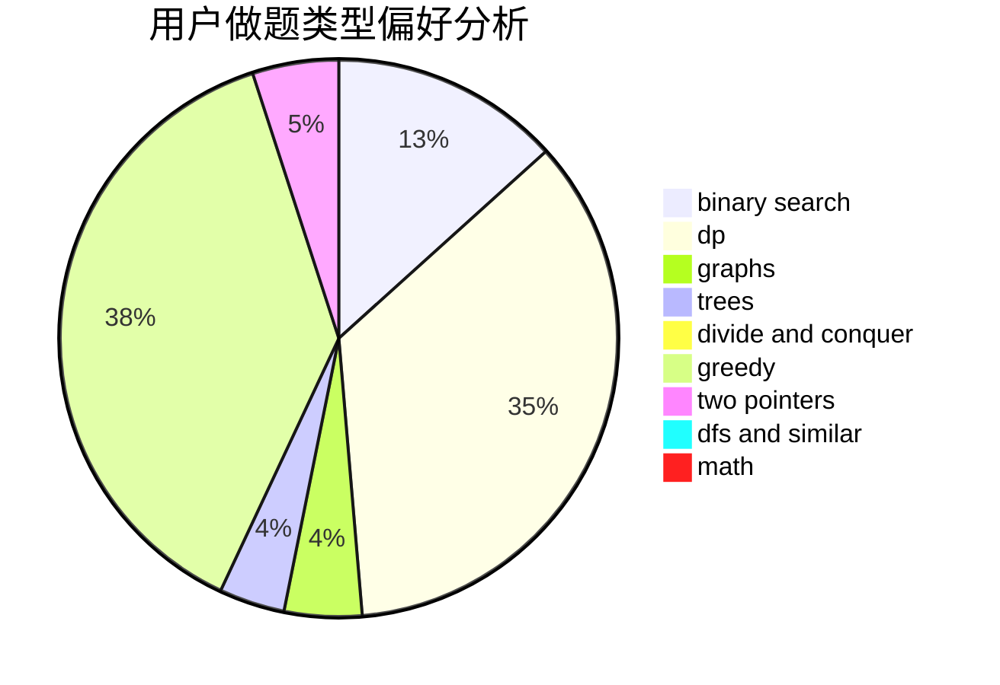

# starusc

<!-- tabs:start -->

#### **用户提交结果分析**

#### **用户做题类型偏好分析**

<!-- tabs:end -->
# 推荐题目
[1331H](https://codeforces.com/contest/1331/problem/H)
[396C](https://codeforces.com/contest/396/problem/C)
[1396A](https://codeforces.com/contest/1396/problem/A)
[132C](https://codeforces.com/contest/132/problem/C)
[1117B](https://codeforces.com/contest/1117/problem/B)
[394C](https://codeforces.com/contest/394/problem/C)
[269D](https://codeforces.com/contest/269/problem/D)
[818D](https://codeforces.com/contest/818/problem/D)
[916D](https://codeforces.com/contest/916/problem/D)
[768B](https://codeforces.com/contest/768/problem/B)
