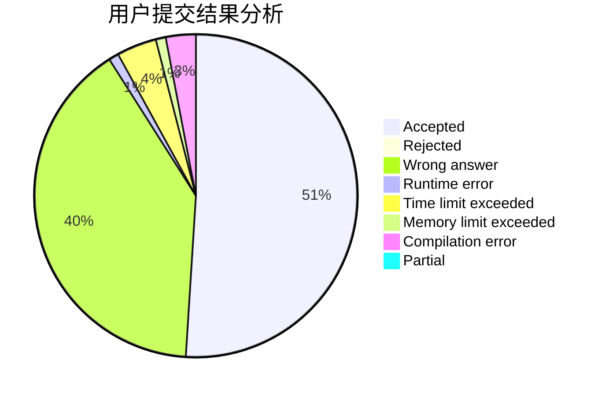
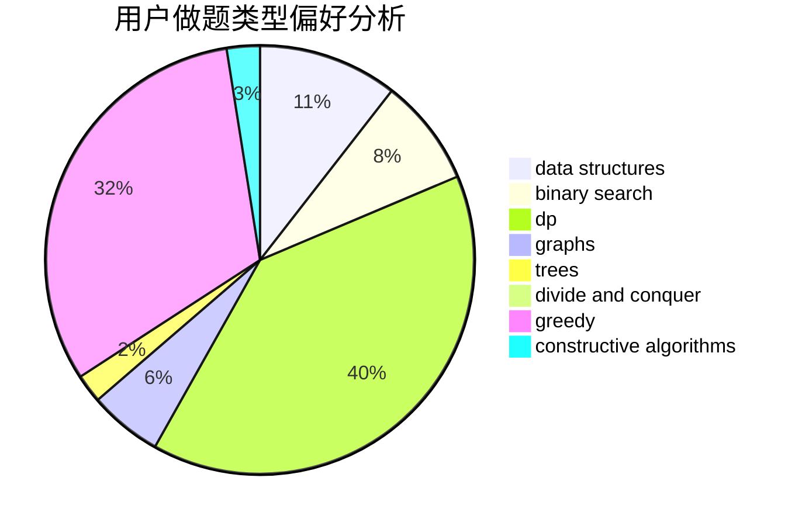
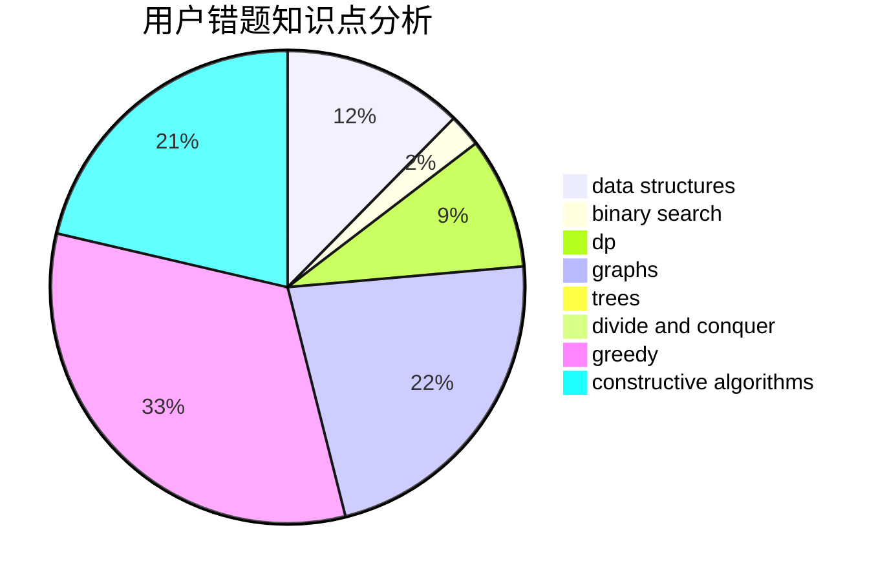

# starusc

<!-- tabs:start -->

#### **用户提交结果分析**

#### **用户做题类型偏好分析**

#### **用户错题知识点分析**

<!-- tabs:end -->
# 推荐题目
[1331H](https://codeforces.com/contest/1331/problem/H)		nan		  
[396C](https://codeforces.com/contest/396/problem/C)		data structures,
                        graphs,
                        trees		  
[1396A](https://codeforces.com/contest/1396/problem/A)		constructive algorithms,
                        greedy,
                        number theory		  
[132C](https://codeforces.com/contest/132/problem/C)		dp		  
[1117B](https://codeforces.com/contest/1117/problem/B)		greedy,
                        math,
                        sortings		  
[394C](https://codeforces.com/contest/394/problem/C)		constructive algorithms,
                        greedy		  
[269D](https://codeforces.com/contest/269/problem/D)		data structures,
                        dp,
                        graphs,
                        sortings		  
[818D](https://codeforces.com/contest/818/problem/D)		data structures,
                        implementation		  
[916D](https://codeforces.com/contest/916/problem/D)		data structures,
                        interactive,
                        trees		  
[768B](https://codeforces.com/contest/768/problem/B)		constructive algorithms,
                        dfs and similar,
                        divide and conquer		  
