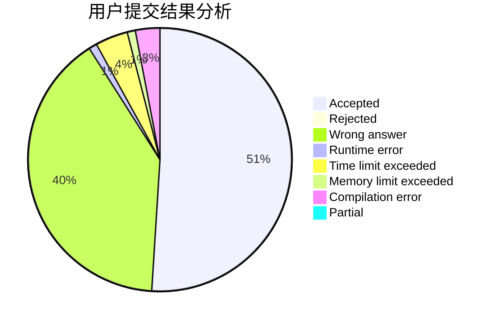
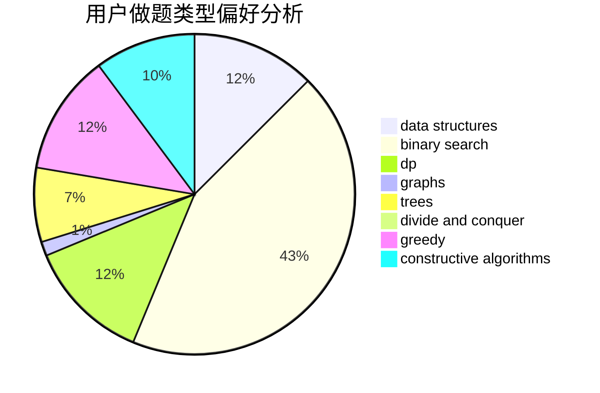

# starusc

<!-- tabs:start -->

#### **用户提交结果分析**

#### **用户做题类型偏好分析**

#### **用户错题知识点分析**

<!-- tabs:end -->
# 推荐题目
[1325D](https://codeforces.com/contest/1325/problem/D)		bitmasks,
                        constructive algorithms,
                        greedy,
                        number theory		  
[366D](https://codeforces.com/contest/366/problem/D)		binary search,
                        data structures,
                        dfs and similar,
                        dsu,
                        shortest paths,
                        two pointers		  
[1385G](https://codeforces.com/contest/1385/problem/G)		2-sat,
                        dfs and similar,
                        dsu,
                        graphs,
                        implementation		  
[1323A](https://codeforces.com/contest/1323/problem/A)		brute force,
                        dp,
                        greedy,
                        implementation		  
[1115U2](https://codeforces.com/contest/1115U/problem/2)		*special problem		  
[366C](https://codeforces.com/contest/366/problem/C)		dp		  
[251B](https://codeforces.com/contest/251/problem/B)		implementation,
                        math		  
[802N](https://codeforces.com/contest/802/problem/N)		binary search,
                        flows,
                        graphs		  
[900A](https://codeforces.com/contest/900/problem/A)		geometry,
                        implementation		  
[749B](https://codeforces.com/contest/749/problem/B)		brute force,
                        constructive algorithms,
                        geometry		  
