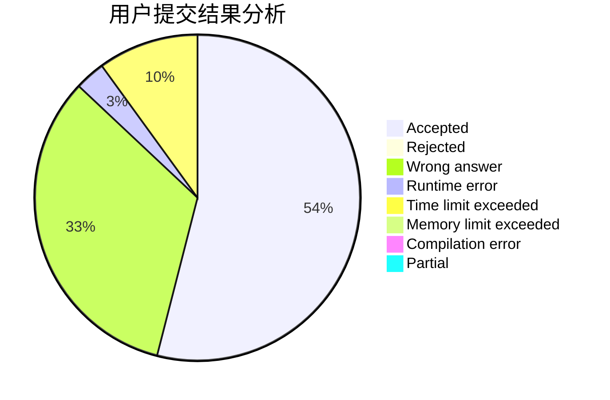
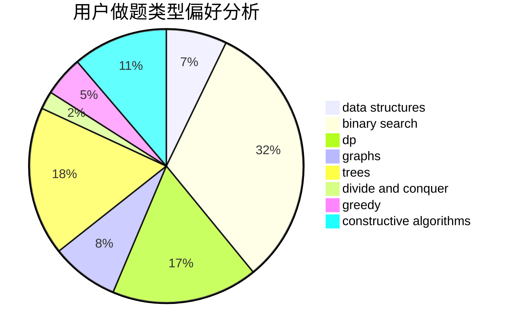

# starve_to_death

<!-- tabs:start -->

#### **用户提交结果分析**

#### **用户做题类型偏好分析**

#### **用户错题知识点分析**

<!-- tabs:end -->
# 推荐题目
[136C](https://codeforces.com/contest/136/problem/C)		dsu,graphs,sortings,trees		  
[59A](https://codeforces.com/contest/59/problem/A)		implementation,
                        strings		  
[11571](https://codeforces.com/contest/1157/problem/1)		dsu,graphs,sortings,trees		  
[669C](https://codeforces.com/contest/669/problem/C)		dsu,graphs,sortings,trees		  
[15D](https://codeforces.com/contest/15/problem/D)		data structures,
                        implementation,
                        sortings		  
[139A](https://codeforces.com/contest/139/problem/A)		implementation		  
[907B](https://codeforces.com/contest/907/problem/B)		implementation		  
[480B](https://codeforces.com/contest/480/problem/B)		dsu,graphs,sortings,trees		  
[219A](https://codeforces.com/contest/219/problem/A)		implementation,
                        strings		  
[870B](https://codeforces.com/contest/870/problem/B)		greedy		  
