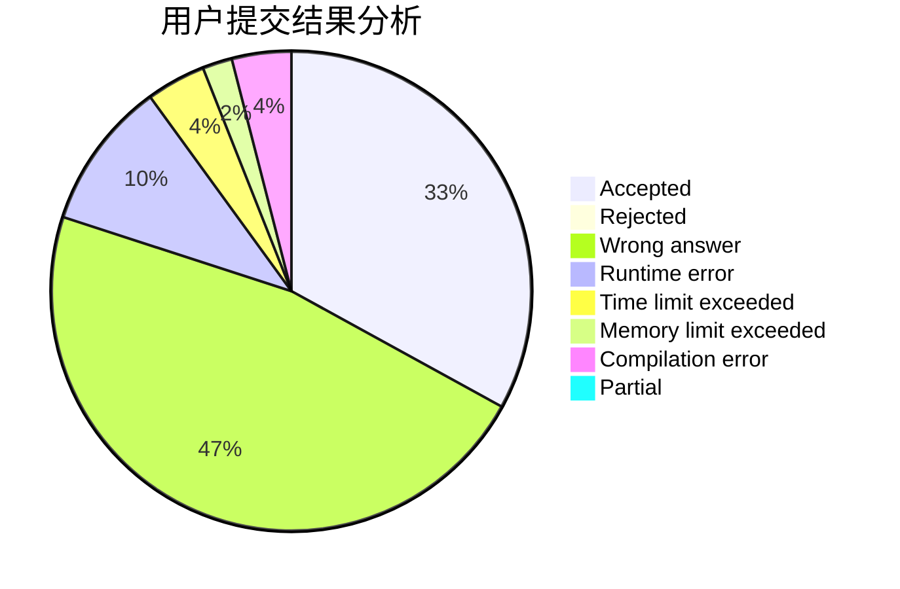
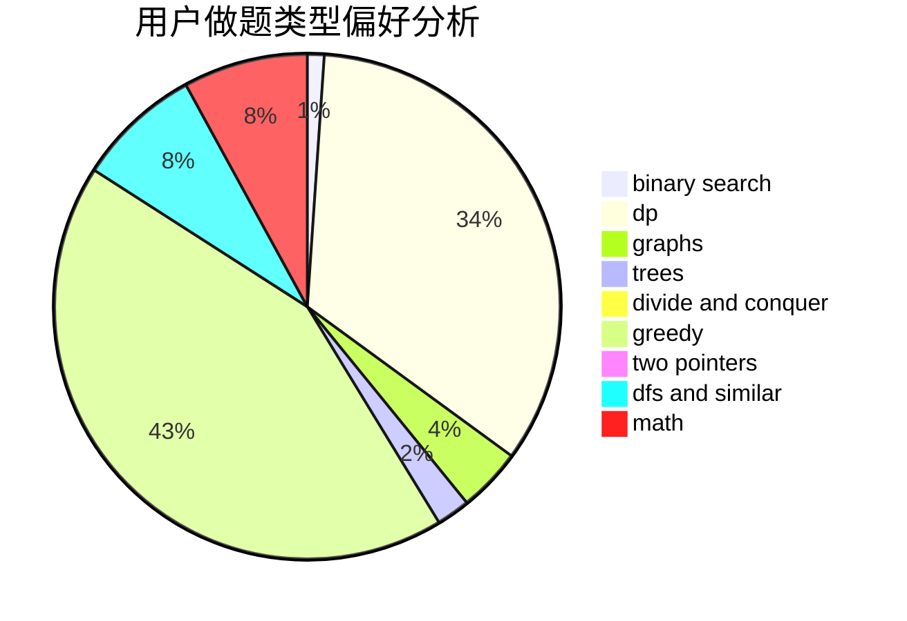

# stevenzhang

<!-- tabs:start -->

#### **用户提交结果分析**

#### **用户做题类型偏好分析**

<!-- tabs:end -->
# 推荐题目
[883C](https://codeforces.com/contest/883/problem/C)
[1393D](https://codeforces.com/contest/1393/problem/D)
[743E](https://codeforces.com/contest/743/problem/E)
[11302](https://codeforces.com/contest/1130/problem/2)
[1057B](https://codeforces.com/contest/1057/problem/B)
[363B](https://codeforces.com/contest/363/problem/B)
[938A](https://codeforces.com/contest/938/problem/A)
[761F](https://codeforces.com/contest/761/problem/F)
[124A](https://codeforces.com/contest/124/problem/A)
[626F](https://codeforces.com/contest/626/problem/F)
