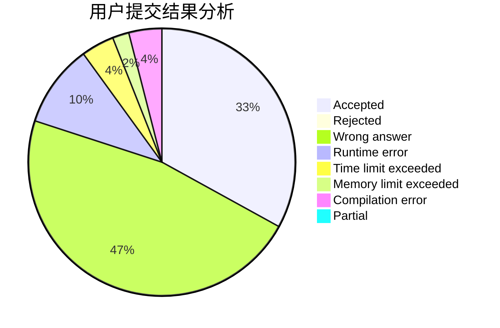
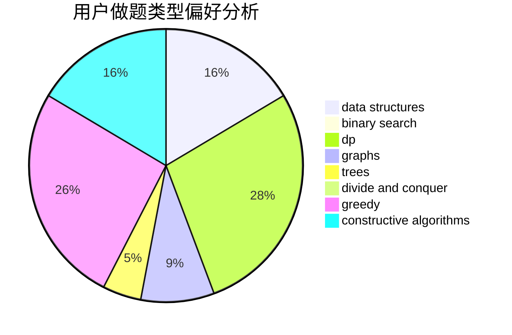

# stevenzhang

<!-- tabs:start -->

#### **用户提交结果分析**

#### **用户做题类型偏好分析**

#### **用户错题知识点分析**

<!-- tabs:end -->
# 推荐题目
[883C](https://codeforces.com/contest/883/problem/C)		binary search,
                        implementation		  
[1393D](https://codeforces.com/contest/1393/problem/D)		dfs and similar,
                        dp,
                        implementation,
                        shortest paths		  
[743E](https://codeforces.com/contest/743/problem/E)		binary search,
                        bitmasks,
                        brute force,
                        dp		  
[11302](https://codeforces.com/contest/1130/problem/2)		dsu,graphs,sortings,trees		  
[1057B](https://codeforces.com/contest/1057/problem/B)		*special problem,
                        brute force		  
[363B](https://codeforces.com/contest/363/problem/B)		brute force,
                        dp		  
[938A](https://codeforces.com/contest/938/problem/A)		implementation		  
[761F](https://codeforces.com/contest/761/problem/F)		brute force,
                        data structures,
                        dp,
                        implementation		  
[124A](https://codeforces.com/contest/124/problem/A)		math		  
[626F](https://codeforces.com/contest/626/problem/F)		dp		  
