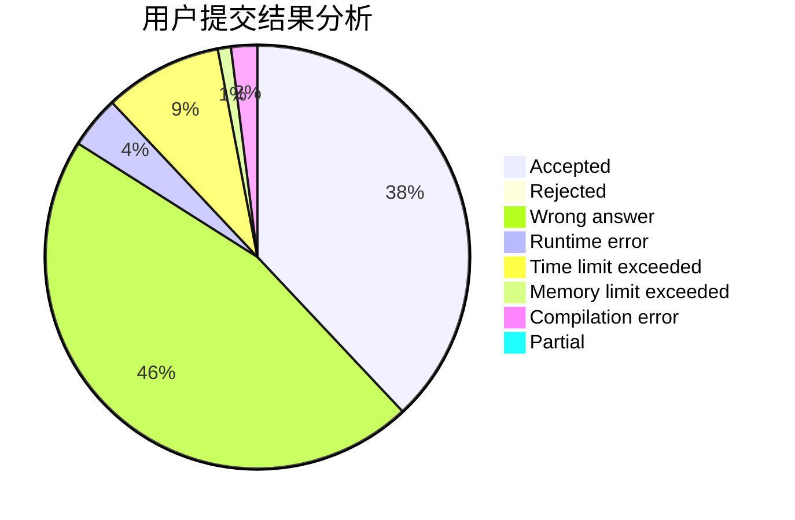
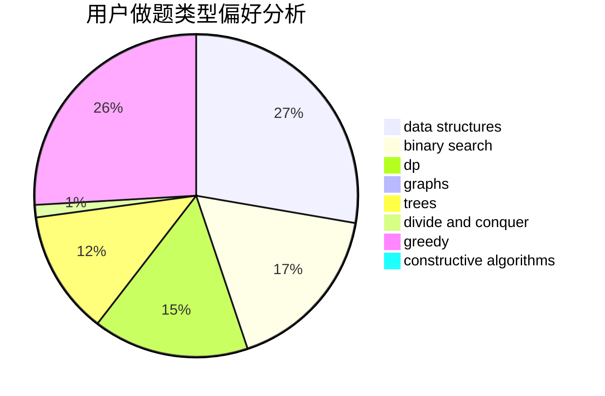
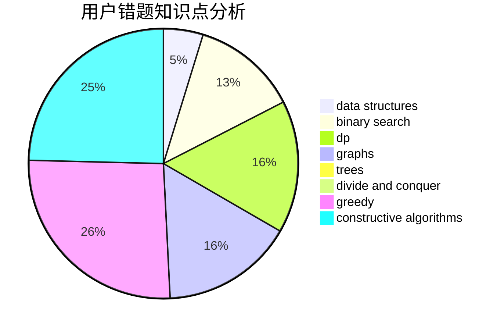

# CQU-Songer

<!-- tabs:start -->

#### **用户提交结果分析**

#### **用户做题类型偏好分析**

#### **用户错题知识点分析**

<!-- tabs:end -->
# 推荐题目
[472D](https://codeforces.com/contest/472/problem/D)		dfs and similar,
                        dsu,
                        shortest paths,
                        trees		  
[189A](https://codeforces.com/contest/189/problem/A)		brute force,
                        dp		  
[1352B](https://codeforces.com/contest/1352/problem/B)		constructive algorithms,
                        math		  
[260E](https://codeforces.com/contest/260/problem/E)		binary search,
                        brute force,
                        data structures		  
[604A](https://codeforces.com/contest/604/problem/A)		implementation		  
[1276A](https://codeforces.com/contest/1276/problem/A)		dp,
                        greedy		  
[603C](https://codeforces.com/contest/603/problem/C)		games,
                        math		  
[106B](https://codeforces.com/contest/106/problem/B)		brute force,
                        implementation		  
[1154B](https://codeforces.com/contest/1154/problem/B)		math		  
[1276C](https://codeforces.com/contest/1276/problem/C)		brute force,
                        combinatorics,
                        constructive algorithms,
                        data structures,
                        greedy,
                        math		  
