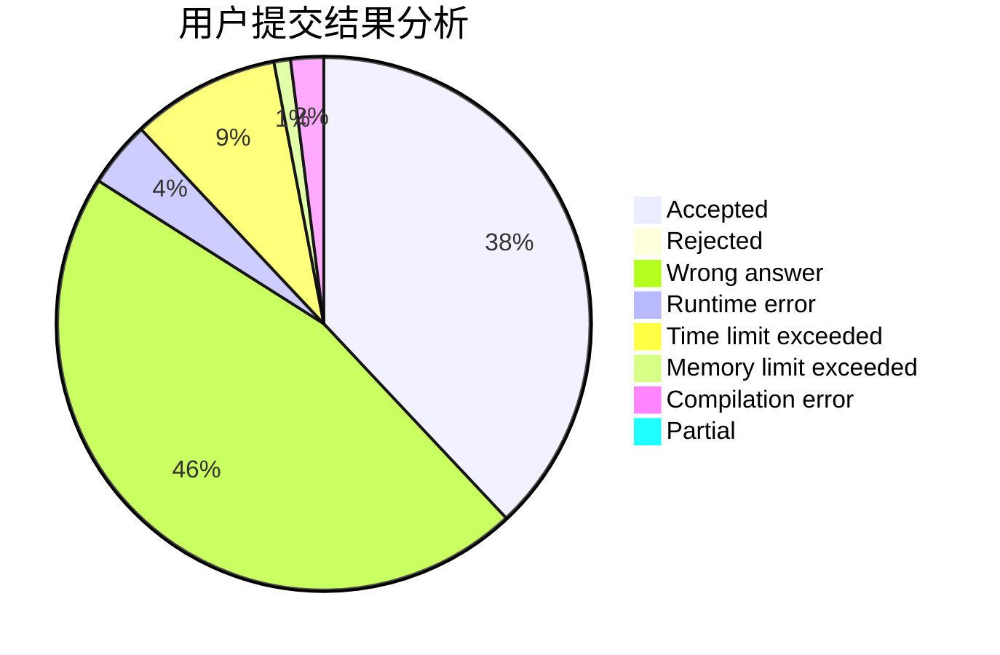
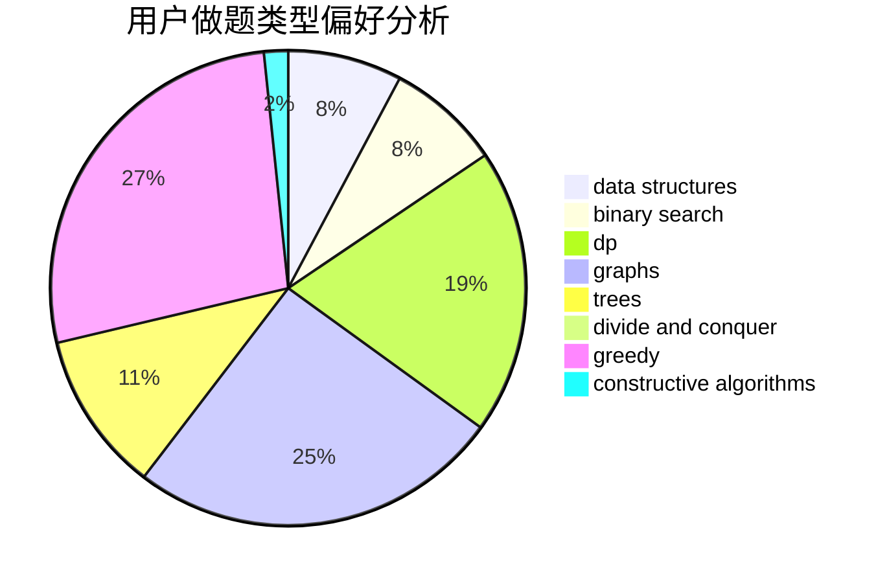
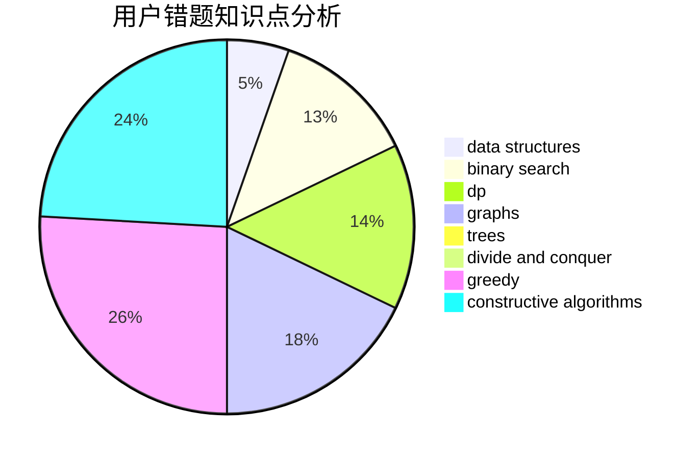

# CQU-Songer

<!-- tabs:start -->

#### **用户提交结果分析**

#### **用户做题类型偏好分析**

#### **用户错题知识点分析**

<!-- tabs:end -->
# 推荐题目
[491B](https://codeforces.com/contest/491/problem/B)		greedy,
                        math		  
[212E](https://codeforces.com/contest/212/problem/E)		dfs and similar,
                        dp,
                        trees		  
[1358F](https://codeforces.com/contest/1358/problem/F)		binary search,
                        constructive algorithms,
                        greedy,
                        implementation		  
[279D](https://codeforces.com/contest/279/problem/D)		bitmasks,
                        dp		  
[622C](https://codeforces.com/contest/622/problem/C)		data structures,
                        implementation		  
[1282A](https://codeforces.com/contest/1282/problem/A)		implementation,
                        math		  
[622A](https://codeforces.com/contest/622/problem/A)		implementation,
                        math		  
[1070B](https://codeforces.com/contest/1070/problem/B)		data structures,
                        greedy		  
[1156B](https://codeforces.com/contest/1156/problem/B)		dfs and similar,
                        greedy,
                        implementation,
                        sortings,
                        strings		  
[1282D](https://codeforces.com/contest/1282/problem/D)		constructive algorithms,
                        interactive,
                        strings		  
